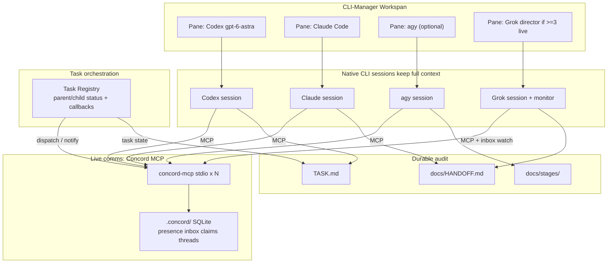
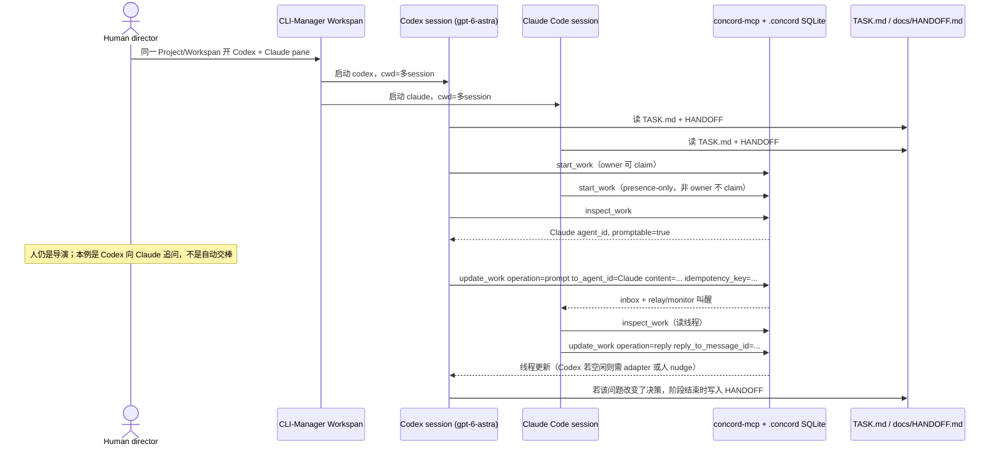

# 多模型 Session 通信与任务编排：CLI-Manager Workspan + Concord MCP

| 字段 | 值 |
| --- | --- |
| 文档标题 | 多模型 Session 通信与双模式任务编排设计（个人工作流） |
| 作者 | 待用户署名 |
| 日期 | 2026-09-14 |
| 状态 | Final design baseline（待实现） |
| 首个落地目录 | `C:\Users\Administrator\Nutstore\1\me\workrtai` |
| 读者 | 负责实现和验收 CLI-Manager + Workbench 的本人 |

本文是**可执行规格**，不是幻灯片。Day-1 先不改 CLI-Manager，用 sidecar 验证通信；最终集成阶段以 CLI-Manager 的 daemon / Workspan 能力为适配面，在 fork 中加入最小 Workbench command 和任务面板。

---

## Overview

当前需求同时包含两种协作模式：

1. **人工指定的平级接力**：在一个项目内，A 模型拆分或实现任务，人指定 B 模型审查并输出报告，A 读取报告后修改；后续阶段再切换到 C、D 等模型继续推进。
2. **主 Agent 委派子任务**：A 模型正在执行主任务时，创建一个有明确父子关系的子任务，指定 B 模型作为子 Agent 执行；B 可以与 A 双向通信，完成后自动回传结构化结果，A 再更新主任务并继续工作。

CLI-Manager 仍然是已有工作流的入口：在同一项目目录内并行打开 Codex（GPT-6）、Claude Code、agy、Grok Build 等原生 CLI。设计目标不是替换 CLI-Manager，而是在其上补齐跨模型通信、任务状态和受控委派。

方案把六层拆开，互不抢 session 所有权：

1. **CLI-Manager Workspan** 继续当 UI / PTY 宿主（不换成 CAO / Claw Orchestrator）。
2. **各原生 CLI session** 各自保活，上下文留在原 session 里。
3. **Agent Workbench Bridge / Task Registry** 管理任务类型、父子关系、模型指派、状态、依赖、回调和重试；它不拥有 CLI session。
4. **Pattern Runtime** 读取声明式 Pattern，决定角色、fan-out、轮次、质量门和预算；不把业务策略硬编码进 Bridge。
5. **Concord MCP** 作为**唯一** live coordination bus：presence、inbox、prompt/reply、claims，以及 Bridge 和各 session 的通知通道。不要 Agent Room，不要预留可换 room 接口。
6. **Workbench SQLite + Markdown/knowledge**：SQLite 保存运行时图和事件，`TASK.md` + `docs/HANDOFF.md` + `docs/stages/` + `docs/knowledge/` 保存可读审计和冷启动输入。

A2A（含 [a2a-bridge](https://github.com/firstintent/a2a-bridge)）仍放在后续阶段，叠在 Concord 之上，不替换它。人控制项目级目标、阶段和模型策略；在授权范围内，主 Agent 可以创建子任务并委派给指定模型。系统不做无边界的自动选模、投票或 swarm。

**Day-1 主路径是 Codex（GPT-6）↔ Claude Code 的 live prompt/reply，并验证人工审查接力。** 子 Agent 编排作为后续阶段加入，但从第一天起就按统一任务模型设计。Grok director 与 agy 都不是这条路径的前置。要被提问或接收子任务的 session 必须 `start_work` 注册 presence；`TASK.md` owner 只约束谁可以直接改文件，子任务权限还要受任务范围约束。

已决议（2026-09-13）：总线只留 Concord；≥3 个模型 session 同时活着才开专职 Grok director pane；任务夹 `git init`（`.concord/` ignore，HANDOFF/stages/kit 入库）；Gemini 族右窗用 **agy**，不用官方 Gemini CLI。

### 最终落地基线（2026-09-14）

最终方案不是“再找一个会话编排器”，而是一个围绕 CLI-Manager 的本地系统：

```text
CLI-Manager Workspan / daemon
        │ 既有 pane、PTY、后台任务、Hook、历史和恢复
        ▼
Agent Workbench Bridge（新增，本地 sidecar 或 CLI-Manager fork 内模块）
        │ patterns、DAG、角色、预算、质量门、事件和回调
        ├── Concord MCP：live presence / prompt / reply / claim / handoff
        ├── Workbench SQLite：pattern run / task graph / event ledger / artifacts
        └── Markdown export：TASK / HANDOFF / stages / knowledge
```

推荐最终形态是 **CLI-Manager fork + Agent Workbench Bridge**：Bridge 使用 CLI-Manager 已有的 daemon client 和 Workspan store 创建/绑定子 Session，前端增加任务树、事件流、证据和人工接管面板。为了先验证通信链路，Bridge 也可以先作为独立 Node/TypeScript sidecar 运行；sidecar 必须通过版本协商的 daemon 协议连接本机 CLI-Manager，不能另起一套 PTY 宿主。

---

## Background & Motivation

### 真实工作流（已确认）

1. 新建任务文件夹。
2. 在 CLI-Manager 建 Project / Workspan，指向该文件夹。
3. 在该工作区里把任务做完。
4. **由你**决定顶层阶段和模型策略；在明确授权的范围内，当前主 Agent 也可以拆出子任务并点名另一个模型执行。
5. 典型组合：架构用 Codex `gpt-6-astra`，审查用 Claude Code，拆任务/对齐用 **agy**（本机 Antigravity CLI，不用官方 Gemini CLI）。
6. 一个模型做完后，下一模型需要能继续对话，而不是只读一份被摘要过的文件。
7. A 模型在执行主任务时，可能把浏览器操作、测试、资料核查等独立工作委派给 B 模型；B 完成后必须把结果自动回传给 A。

这两类流程必须共存：人工接力强调阶段之间的审查和模型切换；子 Agent 模式强调任务树、父子通信和完成回调。两者都使用同一项目状态、同一 Concord 总线和同一批原生 CLI Session。

Handoff 文件是有损的：发送方一旦总结，细节、否决过的方案、未成文的假设都会丢。A2A JSON-RPC 任务委派同样不是「自动共享完整 session」。信息保全靠三件事同时成立：

1. 双方 session **活着**。
2. 可以**双向追问**。
3. 有一份**即使 session 死了也能冷启动**的共享工作状态。

### 现状（2026-09-13 本机核实）

| 项 | 值 |
| --- | --- |
| OS / Shell | Windows / PowerShell |
| CLI-Manager | 本机记录 v1.3.8（需运行时读取 `C:\Users\22908\.cli-manager\daemon.json`）；上游 `master` 在 2026-09-14 为 v1.3.10，daemon 协议版本必须握手协商 |
| 数据目录 | `C:\Users\22908\.cli-manager` |
| 分组 | `自用`（id `8bd3400b-fafe-4cf5-af7b-0d3e73595037`） |
| Project `分析招聘` | path `C:\Users\Administrator\Nutstore\1\me`, `cli_tool=codex`, `worktree_strategy=disabled` |
| Project `多session` | path `C:\Users\Administrator\Nutstore\1\me\workrtai`, `cli_tool=grok`, `worktree_strategy=disabled` |
| 当前 Workspan | `workspan-mtzv1em9-1`，仅 1 个 Grok pane |
| 工作区内容 | **空**（无现成代码可引用）；今天还不是 git repo。**决议（Q3=A）：本目录将 `git init`**。`.concord/` ignore；`docs/stages/`、`docs/HANDOFF.md`、`docs/kit/` 入库。仍建议显式 `CONCORD_REPO_ROOT`，不要只靠探测 |
| Grok Build | `C:\Users\22908\.grok\bin\grok.exe`，`grok 1.0.30`，model `grok-4.6`，`permission_mode=always-approve` |
| Grok folder trust | `C:\Users\22908\.grok\trusted_folders.toml` **没有** `C:\Users\Administrator\Nutstore\1\me\workrtai`，也没有 `C:\Users\Administrator\Nutstore\1\me`（只有 Desktop 与 `E:\zuhaowan\aihub\aihub`）。项目 `AGENTS.md` / `.grok/config.toml` MCP **未信任则不加载** |
| Codex | `codex-cli 0.153.4`，`model=gpt-6-astra`，`approval_policy=never`，`sandbox_mode=danger-full-access`；`[projects.'e:\zuhaowan\me'] trust_level="trusted"`（另有 `e:\zuhaowan`）。**子目录 `多session` 无单独条目**，第一次在该 cwd 启动仍可能弹出信任提示 |
| Claude Code | `C:\Users\22908\.local\bin\claude.exe`，`2.1.263` |
| Gemini | **PATH 上没有 `gemini`**。存在 Antigravity CLI：`agy.exe` `1.1.27`（`C:\Users\22908\AppData\Local\agy\bin\agy.exe`） |
| agy MCP | 官方路径是用户级 `C:\Users\22908\.gemini\config\mcp_config.json`（本机存在且为空）或插件 `plugins/<name>/mcp_config.json`。**不读**项目 `.gemini/settings.json`。agy 已 trust `E:\zuhaowan` |
| Node.js / npm / npx | **当前 PATH 上不存在**（Concord 安装的阻塞项，Gate-0） |
| Concord | **未安装**（`concord` / `concord-mcp` 均不在 PATH） |
| CLI-Manager 能力边界 | 多 pane、Workspan、daemon PTY、后台任务、Hook、会话恢复、Claude 子 Agent 自动分屏与历史。**没有**跨 CLI 的项目任务图或 inter-agent messaging；daemon NDJSON 有 `list/create/write/attach`，但不是公开稳定的任务编排 API |

CLI-Manager 不是总线。它只负责把四个 CLI 拉起来、cwd 指到同一文件夹。通信必须由这些 CLI 自己连上的 MCP server 完成。

### 痛点

- 阶段切换靠复制粘贴或写一份 HANDOFF，上下文被压缩。
- CLI-Manager 的 Claude↔Codex session 转换是**转写**，不是 live 对话，不能当主通道。
- 各 CLI 只认 MCP，不认 A2A。Day-1 上 A2A 等于再养一套 daemon，且 Task payload 仍可能被发送方摘要。
- 若引入 CAO / Claw Orchestrator，会和 CLI-Manager 抢「谁拥有 session」。

---

## Key Decisions

每一条都是约束，实现时不要悄悄合并层。

| # | 决策 | 理由 |
| --- | --- | --- |
| D1 | **六层分离**：Workspan/daemon = UI + PTY；原生 CLI session = 上下文容器；Workbench Bridge = 任务生命周期；Pattern runtime = 协作策略；Concord MCP = live coordination；Workbench SQLite + Markdown/knowledge = 运行时状态与 durable audit | 保活 + 双向追问 + 子任务编排 + 模式迭代 + 死 session 可冷启动。编排层不接管 CLI-Manager 的 session 所有权。 |
| D2 | **不替换 CLI-Manager，但允许 fork 内集成 Bridge**。CAO / Claw Orchestrator / AgentsRoom 不当宿主 | UI、daemon、Workspan、Hook 和历史继续由 CLI-Manager 负责；新增能力只通过已有 daemon client / Workspan store 接入。 |
| D3 | **人控制顶层；主 Agent 可受控委派**。不做无边界自动选模、voting / swarm | 人决定项目目标、阶段和可用模型；A 只能在授权范围内创建子任务并指定 B。模型不能擅自改变项目 owner 或扩大文件/工具权限。 |
| D4 | **唯一 live coordination bus = Concord MCP**（`@concord-ai/concord-mcp`，Get-Concord-AI）；Workbench Bridge 叠在总线之上 | Concord 负责 presence、inbox、prompt/reply、claims、版本化 handoff 和 review evidence；Workbench SQLite 负责 pattern run、DAG、预算、事件和 artifact 索引。不要 Agent Room，不要预留可换 room 接口。 |
| D5 | **不要装错包**：用 `@concord-ai/concord-mcp`，**不要**用 npm 上的 `concord-mcp`（那是连 `https://concord.fenginwind.com` 的托管房间），也不是 Concord CLM 合同产品 | 同名产品会把对话打到公网后端。 |
| D6 | **`worktree_strategy=disabled` 保持不变** | 所有 CLI 必须共享同一 cwd，否则 Concord 的 `.concord/` SQLite 会分裂。 |
| D7 | **Live bus 传问题与指针；HANDOFF 传决策与验收**。禁止把完整 session dump 进 HANDOFF，也禁止只靠 HANDOFF 当唯一通道 | 摘要有损；文件又是冷启动的唯一可靠输入。 |
| D8 | **禁止把 CLI-Manager session 转换当主通道** | 转换是事后转写，没有双向 Q&A，也没有 presence。 |
| D9 | **MCP 尽量项目作用域**，不要污染全局 `C:\Users\22908\.codex\config.toml`（里面已有 `node_repl` 等） | 本实验只服务这个任务夹；全局 Codex 配置已经很重。 |
| D10 | **Concord 生成的 `.concord/HANDOFF.md` ≠ 本仓库的 `docs/HANDOFF.md`** | 前者是 Concord 运行时产物（默认 gitignore）；后者是你规定的 durable packet，阶段结束必须更新。 |
| D11 | **仅 Grok session** 用 `monitor` + `concord inbox watch --provider grok`；每个 Grok session 只开一个。Codex/Claude/agy 不要跑这条命令。**专职 Grok director pane 仅当 ≥3 个模型 session 同时活着才开**（inspect_work + inbox monitor + stale 汇报）。两个 pane（Codex+Claude）时不开第四窗。Day-1 仍是 Codex↔Claude，不依赖 Grok | 2026-09-13 决议 Q2=C。来源：[docs/grok-build.md](https://github.com/Get-Concord-AI/concord-mcp/blob/main/docs/grok-build.md)。Claude 空闲叫醒靠 `concord-relay`。 |
| D12 | **Phase 3 的 A2A / a2a-bridge 叠在 Concord 之上，不拆 Concord** | A2A 解决跨主机 / AgentCard / 不会 MCP 的 agent；不解决「本机多 CLI 保活对话」。 |
| D13 | **presence ≠ 文件 claim ≠ `TASK.md` owner。** 每个仍要被提问（或要提问）的 live session 启动时都 `start_work` 注册 presence；顶层 owner 负责项目看板，reviewer 默认只读；已授权的 child Agent 可以在 `allowed_paths` 内建立 delegated claim 并编辑。`inspect_work` 只读，不能建立在场 | Concord README：`start_work` registers presence；`update_work operation=prompt` 只能打 promptable 的在场 agent。Day-1 是 Codex 问 Claude，而初始 owner 是 human / 架构阶段是 Codex——Claude 若不 `start_work` 就不可 prompt，live 主通道作废。人导演限制顶层 owner；Task Registry 进一步限制 child 的路径、工具和生命周期。 |
| D14 | **人写的规则胜于 Concord 生成块。** `concord setup --no-mcp` 仍会写 `AGENTS.md`、`CLAUDE.md`、**项目 `.codex/` 指令**、`.cursor/rules/`。setup 前快照这些路径，setup 后：用 kit 覆盖 `AGENTS.md`/`CLAUDE.md`；`.codex/` 只保留手写的 `config.toml`（MCP），删掉 Concord 塞进该目录的其它规则文件；本工作流不用 Cursor，若 Concord 创建了 `.cursor/rules/` 则删除。不得保留 auto-handoff / `transfer_work` 当主交接 | `--no-mcp` 不等于 `--no-instructions`。Codex 会读项目 `.codex/` 规则，只恢复根目录 Markdown 不够。 |
| D15 | **禁止硬编码 / 编造 `agent_id`。** 第一次 `start_work` 不传自造 id（optional 则省略）。id 是返回值，回填 `TASK.md` roster 后，后续 write 才带上。`to_agent_id` 只从最近一次 `inspect_work` 的在场列表抄 | 写死或猜 id 会导致 prompt 打到已死 session。Concord 对端不可达时**立即失败且不 reroute**。 |
| D16 | **所有 `concord-mcp` env 默认 `CONCORD_TELEMETRY_DISABLED=1`**（或 `DO_NOT_TRACK=1`）。可删，但是知情选择 | 官方 `@concord-ai/concord-mcp` 仍默认向 `getconcord.ai` 发 product/coordination 遥测（随机 id、操作名与耗时、投递阶段；声称不含代码/路径/正文，但 IP 会留在服务端）。这与 D5「不要把对话打到托管后端」的精神一致：本机总线默认不出网。 |
| D17 | **本任务夹用 git 管理。** `.concord/` 进 `.gitignore`。`docs/stages/`、`docs/HANDOFF.md`、`docs/kit/`、规则与项目 MCP 配置入库。仍显式设置 `CONCORD_REPO_ROOT`，不要只靠仓库根探测 | 2026-09-13 决议 Q3=A。今天目录还不是 git repo，落地时 `git init`。冷启动可用 `git diff`。 |
| D18 | **Gemini 族右窗 = 本机 `agy`（Antigravity CLI），不用官方 Gemini CLI。** MCP 只走用户级 `~\.gemini\config\mcp_config.json`，`CONCORD_REPO_ROOT` 钉死任务夹；换夹必须改 env。**不要**创建或依赖项目 `.gemini/settings.json` 来假装 agy 已接线 | 2026-09-13 决议 Q4=B。agy 1.1.27 文档只承认用户级 / 插件 MCP。PATH 上无 `gemini`。 |
| D19 | **任务关系是任务级的，不是模型级的**。同一个模型 Session 可以先做 reviewer，再作为另一个任务的 child；同一个模型也可以在不同项目中担任不同角色 | 角色由 `task_type`、`parent_task_id`、权限范围和当前 owner 决定，不能把某个 CLI 永久绑定为“主 Agent”或“子 Agent”。 |
| D20 | **子任务完成必须发结构化回调**。至少包含状态、摘要、修改文件、验证证据、阻塞原因和下一步建议 | 主 Agent 不能靠轮询聊天记录判断完成；Workbench Bridge 收到事件后更新 Task Registry，并通过 Concord 唤醒/通知父 Session。 |
| D21 | **Pattern 是声明式配置，Runtime 是通用执行器**。Pattern 不包含编排代码 | `document_review`、`distributed_coding`、`iterative_coding`、`gui_verify` 可以复用同一套 dispatch、gate、callback 和 resume 机制。 |
| D22 | **允许运行时自适应，但必须有硬上限** | Pattern 可以增减 worker、改变轮次或追加 verifier；`max_agents`、`max_rounds`、`timeout`、`budget` 和 `requires_human_approval` 防止失控。 |
| D23 | **失败尝试、批评和反例是资产** | 不删除失败 child 的产出；写入 `knowledge/pitfalls` 和 artifact ledger，下一轮可以引用并避免重复犯错。 |
| D24 | **每个 Pattern 都必须有质量门** | 没有通过测试、review、evidence 或人工 acceptance 的结果不能进入 `synthesis` 或标记父任务完成。 |
| D25 | **CLI-Manager daemon 协议只作为适配契约** | 使用 `auth → list/create/write/attach/status` 和 `output/exit/hook_report`，先检查 `protocol_version` / features；版本不兼容时停在 `blocked`，不猜字段。 |
| D26 | **Workbench 使用独立 CLI-Manager fork / 发行版** | fork 使用 `com.cli-manager.workbench`、`%USERPROFILE%\\.cli-manager-workbench` 和独立 daemon discovery/bootstrap；不读取、复用或迁移现有 CLI-Manager 的 `.cli-manager` 数据，允许两套进程并行运行。 |

三套身份对照（禁止绑死）：

| 层 | 是什么 | 谁写入 | 决定什么 |
| --- | --- | --- | --- |
| Concord presence / `agent_id` | 本 live session 在总线里的活身份 | 该 session 的 `start_work`（每次新 session 都变） | 能否被 `prompt`；`inspect_work` 能否看见你 |
| Concord claim | 对该路径/任务的编辑预约 | Current owner，或由其授权且被 Task Registry 记录的 child Agent | 能否改那些文件；overlap 时谁停手 |
| `TASK.md` Current owner | 人点名的顶层干活者 | **只由人**改 `TASK.md`（模型不得把顶层 owner 改给自己以外的 CLI） | 谁负责项目阶段；不决定谁可以在场，也不阻止已授权 child 在 scope 内编辑 |
| CLI-Manager pane / session | PTY 窗口 | 人开/关 pane | 窗口活着 ≠ Concord 在场。未 `start_work` 的活 pane 对总线是隐形的 |
| Task Registry role | 当前任务中的 `main` / `reviewer` / `child` / `observer` | 创建或更新任务时写入 | 决定任务关系、回调目标和允许的操作；不替代 `agent_id`，不自动授予文件权限 |

---

## Goals & Non-Goals

### Goals（Day-1）

- 在 `C:\Users\Administrator\Nutstore\1\me\workrtai` 放下可复制的文件套件（规则、任务板、HANDOFF、阶段笔记）。
- 同一 Workspan 内至少 **Codex + Claude** 连上**同一个** Concord workspace（agy / Grok director 可选，且 Grok director 仅 ≥3 活 session）。
- Codex（GPT-6）能向仍活着的 Claude session **提问**；Claude 能 **回复**；你不用复制粘贴。**两边都要 `start_work`，即使 `TASK.md` owner 只是其中一个。**
- Claude 空闲时的唤醒路径是 `concord-relay`（或人在 pane 里 nudge）。Grok monitor **不是**这条验收的前置。
- 阶段结束有一份 `docs/HANDOFF.md`，session 死后下一模型仍能冷启动。
- 按本文命令能在**同一 Project `多session` 的 Workspan** 里开 Codex+Claude（第三窗可选），发出**第一条**跨模型问题。
- 用一个真实例子验证**人工审查接力**：Codex 产出 → 人指定 Claude 审查 → Claude 报告回传 → Codex 继续修改。

### Goals（双模式目标）

- **模式 A：平级接力 / 审查**。任何阶段都可以由人指定另一个模型执行 `review_task`、`handoff_task` 或 `integration_task`，结果回到项目状态并可被原 Session 追问。
- **模式 B：主 Agent / 子 Agent**。主 Agent 可以创建 `child_task`，指定 B 模型、文件范围、工具权限和验收标准；B 通过 Concord 与父 Session 通信，完成后由 Workbench Bridge 自动发 `task.completed`（或 `task.blocked` / `task.failed`）事件。
- 两种模式共用项目、Session、任务、产出物和事件记录；区别只在任务关系和完成后的控制流。
- 子任务结果必须包含：`status`、`summary`、`files_changed`、`verification`、`artifacts`、`blockers`、`next_actions`。

### Non-Goals（明确不做）

- 不把 CLI-Manager 换成任何 orchestrator。
- 不引入 Agent Room 或其它第二套 room 总线，不预留「以后换 room」接口。
- 不在 Day-1 上 A2A / a2a-bridge / 官方 A2A server。
- 不用官方 Gemini CLI；不用项目 `.gemini/settings.json` 给 agy 接线。
- 不做无边界的自动选模型、不投票、不 swarm；模型必须由人或主 Agent 按项目策略指定。
- 不启用 Git worktree 隔离。
- 不把完整 transcript 同步到另一 session。
- 不把 Concord 当「共享记忆数据库」替代各 CLI 自己的 session。
- 不在 HANDOFF / TASK / AGENTS 里写 API key、provider token。
- 不修改 `C:\Users\22908\.cli-manager\` 下的 `settings.json` / `sessions.json` / `daemon.json`（设计阶段已只读引用）。

---

## Proposed Design

### 架构分层（禁止合并）

```
┌─────────────────────────────────────────────────────────────────┐
│  CLI-Manager Workspan（UI / 分屏 / daemon PTY）                  │
│  只负责：启动各 CLI、cwd=任务夹、保活 pane。不负责发消息。      │
└─────────────┬───────────────┬───────────────┬──────────────────┘
              │               │               │
     ┌────────▼──────┐ ┌──────▼──────┐ ┌──────▼──────┐ ┌──────────▼─────────┐
     │ Codex session │ │ Claude Code │ │ agy         │ │ Grok director      │
     │ gpt-6-astra   │ │ 完整上下文  │ │ 完整上下文  │ │ 完整上下文         │
     └───────┬───────┘ └──────┬──────┘ └──────┬──────┘ └──────────┬─────────┘
             │ MCP stdio      │ MCP stdio     │ MCP stdio         │ MCP stdio
             │                │               │                   │ + monitor
             └────────────────┴───────────────┴───────────────────┘
                                      │
                          ┌───────────▼────────────┐
                          │ Concord MCP            │
                          │ concord-mcp stdio      │
                          │ .concord/*.sqlite      │
                          │ inbox / prompt / reply │
                          │ presence / claims      │
                           └───────────┬────────────┘
                                       │ 备份，不是唯一通道
                           ┌───────────▼────────────┐
                           │ TASK.md                │
                           │ docs/HANDOFF.md        │
                           │ docs/stages/*.md       │
                           └────────────────────────┘
```

最终集成模式增加一条不拥有 Session 的控制链：

```
┌─────────────────────────────────────────────────────────────────┐
│ Agent Workbench Bridge + Pattern Runtime（本地服务/CLI-Manager fork）│
│ pattern / DAG / dispatch / gate / callback / retry / checkpoint  │
│ 只管理任务生命周期；通过 daemon 绑定 pane，通过 Concord 通知。    │
└───────────────┬───────────────────────────────┬─────────────────┘
                │                               │
       parent_task / child_task          task.completed / blocked
                │                               │
           主 Agent Session  ── Concord ──  子 Agent Session
```

模式 A 不要求每次都启动完整 Pattern Runtime：人可以直接通过 Concord 指定 reviewer，再由阶段记录固化结果。模式 B 必须经过 Bridge 创建父子任务，禁止只靠一条聊天消息“口头委派”。

```
Phase 3 可选：
  a2a-bridge daemon ──A2A/ACP── 外部 agent
         │
         └── 仍通过 MCP 或人工桥接到 Concord，不替换 Concord
```



**负载预期（个人机）：** 同时 2–4 个 CLI，每个 CLI 一个 `concord-mcp` stdio 子进程，共享一份 `.concord/` SQLite。消息速率极低（每分钟若干条 prompt/reply）。总线延迟应是毫秒～百毫秒级；真正的等待是「对方模型被唤醒并跑完一轮」。磁盘：SQLite + 若干 Markdown，可忽略。

### Pattern 目录（声明式，可扩展）

Pattern 文件只描述角色、输入输出、推进条件和限制，不包含启动进程或写数据库的代码。Runtime 负责解释同一套字段：

```yaml
id: document_review
roles:
  main: { required: 1 }
  reviewer: { min: 1, max: 2 }
  verifier: { min: 0, max: 1 }
steps:
  - id: review
    type: review_task
    output: review_report
  - id: revise
    type: parent_resume
  - id: verify
    type: quality_gate
gates:
  - id: review_accepted
    require: [review_report, parent_response]
limits: { max_rounds: 2, max_agents: 3, timeout_minutes: 90 }
human_approval: [final_acceptance]
```

首批 Pattern：

| Pattern | 用途 | 核心流程 |
| --- | --- | --- |
| `manual_handoff` | 人指定下一模型接力 | A → HANDOFF → B → Concord 追问 |
| `document_review` | A 产出、B 审查、A 修改 | propose → critique → revise → verify |
| `distributed_coding` | A 拆解，多个 B 并行 | decompose → fan-out → critic → synthesize → integrate |
| `iterative_coding` | 不可拆任务持续试错 | implement → test → fix → gate |
| `gui_verify` | 浏览器/桌面操作验证 | action → screenshot/log → verifier → gate |

运行时可以根据失败原因追加 verifier 或新一轮 worker，但不得突破 Pattern 的预算和人工审批边界。

---

### 目标目录布局（本仓库 = 第一份实例）

```
C:\Users\Administrator\Nutstore\1\me\workrtai\
├── AGENTS.md                 # 所有 CLI 都读的规则（canonical）
├── CLAUDE.md                 # 5 行指针，避免和 AGENTS.md 重复两套规则
├── GEMINI.md                 # agy 指针（agy 会读；不是官方 Gemini CLI 配置）
├── TASK.md                   # 目标、阶段、当前 owner、模型分配
├── .gitignore                # 必须含 .concord/；其余入库
├── .mcp.json                 # Claude Code project MCP；Grok 也会兼容读取
├── .grok\
│   └── config.toml           # Grok project-scoped MCP（显式 CONCORD_REPO_ROOT）
├── .codex\
│   └── config.toml           # Codex project-scoped MCP（不要写进 ~/.codex/config.toml）
├── orchestrator\              # Agent Workbench Bridge + Pattern Runtime
│   ├── README.md
│   ├── patterns\              # 声明式 pattern YAML/JSON
│   ├── schemas\               # task / event / result schema
│   └── adapters\               # CLI-Manager daemon / Concord / GUI adapters
├── .workbench\                # gitignore；Workbench SQLite、锁和运行时日志
├── docs\
│   ├── HANDOFF.md            # 最新 durable packet（git 跟踪）
│   ├── stages\               # git 跟踪
│   │   └── _TEMPLATE.md
│   ├── knowledge\             # git 跟踪；decisions / pitfalls / failed attempts / verified results
│   └── kit\                  # git 跟踪；路径用占位符 __CONCORD_REPO_ROOT__
│       ├── AGENTS.md
│       ├── CLAUDE.md
│       ├── GEMINI.md
│       ├── TASK.md
│       ├── HANDOFF.md
│       ├── STAGE.md
│       ├── gitignore
│       ├── mcp.json
│       ├── grok.config.toml
│       ├── codex.config.toml
│       └── agy.mcp_config.snippet.json   # 贴进 ~/.gemini/config/mcp_config.json
└── （不要放项目 .gemini/settings.json：agy 不读它，官方 Gemini CLI 本工作流不用）
└── .concord\                 # concord setup 生成；gitignore；运行时 DB
    ├── （SQLite 等，名称以安装后为准）
    ├── HANDOFF.md            # Concord 自己生成的，不是 docs/HANDOFF.md
    └── REVIEW_PACKET.md      # Concord 可选产物
```

**命名纪律**

| 路径 | 谁写 | 谁读 | 是否主通道 |
| --- | --- | --- | --- |
| `AGENTS.md` | 人（偶尔改规则） | 所有 CLI | 规则，不是消息 |
| `TASK.md` | 人 + 当前 owner 阶段结束时更新 | 所有 CLI / 人 | 看板 |
| `docs/HANDOFF.md` | 当前 owner 阶段结束时覆盖写 | 下一模型 / 冷启动 | durable 主包 |
| `docs/stages/*.md` | 当前 owner append-only | 审计 / 冷启动 | 历史 |
| Task Registry | Workbench Bridge + 任务参与者按事件写入 | 主 Agent / 人 / Workbench Bridge | **模式 B 的编排主通道** |
| Concord inbox | 模型 via MCP | 对端模型 | **live 主通道** |
| `.concord/HANDOFF.md` | Concord `finish_work` | 调试 | 备份 |
| CLI-Manager history | CLI-Manager | 人回看 | 观测，不是通道 |

---

### 文件套件：完整模板（可复制）

以下模板是 Day-1 要落到 `C:\Users\Administrator\Nutstore\1\me\workrtai` 的正文。根目录配置写死本机路径；`docs/kit/` 里全部改成占位符 `__CONCORD_REPO_ROOT__`（正斜杠，无尾斜杠），复制脚本做 `-replace`，禁止手改三份漏一份。

#### `AGENTS.md`

```markdown
# AGENTS.md — 多模型 session 通信规则

本目录是一个**共享 cwd** 的多 CLI 工作区。CLI-Manager 只负责开进程。模型之间说话走 Concord MCP，不走复制粘贴，不走 CLI-Manager session 转换。

人写的本文件胜于任何 Concord setup 生成块。不要恢复 auto-handoff / 自动 `transfer_work` 当主交接。

## 角色

- 人是项目导演：决定项目目标、顶层阶段、可用模型和需要人工确认的边界。
- 主 Agent 是当前被指派推进某个主任务的 CLI session。它可以在 `TASK.md` 和 Task Registry 允许的范围内创建子任务，但不能改变项目级 owner 或扩大权限。
- Reviewer / peer Agent 负责被指定的审查、复核或下一阶段接力；它不因收到 prompt 就自动获得文件写权限。
- Child Agent 是绑定了 `parent_task_id` 的执行 Session。它只执行任务包中声明的目标、文件范围和工具范围，完成后必须发结构化结果。
- 你是其中一个 CLI session。保持本 session 活着，直到人或编排策略明确说可以结束。
- 所有模型都是可复用的 Session，不把某个 CLI 永久绑定为主 Agent 或子 Agent。问问题用 Concord；不要假设对方读过你的整段 transcript。

## 三套身份（禁止绑死）

- Concord presence / `agent_id`：你在总线里能不能被看见、被 prompt。靠 `start_work` 建立。`inspect_work` **只读**，不能注册在场。
- Concord claim：你能不能改某批文件。由 `TASK.md` Current owner 或已登记 child Agent 在其 `allowed_paths` 内 claim。
- `TASK.md` Current owner：人点名的干活者。窗口开着 ≠ 你是 owner ≠ 你已在场。

Day-1 口令：Codex 与 Claude **都要在场**（都 `start_work`），即使 owner 只是其中一个。

## 启动时（每个要提问或要被提问的 live session 都做一次）

1. 读 `TASK.md`、`docs/HANDOFF.md`、最近一份 `docs/stages/*.md`。
2. **先 `start_work` 注册 presence**（不要先 inspect 就以为自己在场）。
   - **不要自己造 `agent_id`。** 第一次调用只填 live schema 的必填项；该字段若 optional / 未标 required，一律省略。`agent_id` 是返回值（或随后 `inspect_work` 看到的 id），回填 roster 之后，**后续** write 才带上。
    - 是 reviewer / observer：presence-only。**不要**传 claim paths / 文件 scope，不要编辑。
    - 是 Current owner：可以在同一次或紧接着的 write 里 claim 将编辑的路径。
    - 是已登记的 child Agent：只可 claim Task Registry 任务包中的 `allowed_paths`；这是 delegated claim，实际传入字段仍以 Concord live schema 为准，不得编辑范围外文件，也不得修改 `TASK.md` 顶层 owner。若当前 Concord 不能表达独立 delegated claim，child 返回 patch / artifact，由顶层 owner 应用。
   - 未知字段不要编。schema 没写的参数一律省略。
3. 再 `inspect_work`：谁在场、是否 promptable、inbox、stale claim。把返回（或 `start_work` 返回）的 `agent_id` 告诉人，回填 `TASK.md` roster。`agent_id` 每次新 session 都会变，禁止写进规则当常数，禁止第一次调用前编一个。
4. **仅当本 session 的 CLI 就是 Grok Build**（不要因为本仓库有 Grok 模板就每个模型都做）：确认没有重复的 inbox monitor，然后开一个 persistent `monitor`：
   - command: `concord inbox watch --provider grok`
   - 目的：空闲时有人 prompt 你，这一行输出要能叫醒你。
   - 不要开第二个同样的 monitor。
   - Codex / Claude / agy：跳过本步，用各自 adapter / 等人 nudge。
5. 若 `inspect_work` 显示你不可被 prompt，在回复里明确说「我只能 pull」，并请人在本 pane nudge。

## 什么时候用 live bus（Concord）

必须用 Concord `update_work`：

- 你需要另一模型已经在它 session 里的判断（「你刚才为什么否决方案 B」）。
- 你要指出具体文件/函数让对方当场看。
- 你被问了，必须 `reply`，不要只改文件不回话。

调用约定（名称来自上游 README；**安装后以 MCP 列出的 live schema 为准，禁止发明字段**）：

- 提问：`update_work`，`operation: "prompt"`，`to_agent_id`，`content`，`idempotency_key`。
- 回答：`update_work`，`operation: "reply"`，`reply_to_message_id`，`content`。
- `to_agent_id`：只从最近一次 `inspect_work` 的在场 `agents[]` 抄（用返回里的 id 字段，不要用 roster 里过期的值，不要猜「claude」这种昵称除非 schema 就是那个）。
- 对端不在场或不可达：Concord **立即失败且不 reroute**。不要换一个 id 再打。改走 `docs/HANDOFF.md`，并在 pane 里说「对端不可 prompt」。
- `idempotency_key`：**禁止含时间戳**（新造时会变，busy/timeout 重试会双投）。算法：`{cli}-` + SHA256(`content`) 的前 8 位小写 hex，例如 content 不变则 `codex-a1b2c3d4` 永远同一把。同一问题重试必须原样重发这把 key（可先写进 `docs/stages/` 备忘）；content 改了才换新 key。
- 先 `inspect_work` 确认对端 promptable，再 prompt。

`content` 要求：

- 先写 1 句问题。
- 再给文件路径 + 符号名（不要贴大段代码，除非小于 ~40 行且对方 session 很可能没打开这个文件）。
- 写清你希望的回复形态（结论 / 选项 / 风险）。
- 不要把 API key、token、账号写进 content。

### 模式选择

- 人已经决定“请 B 审查 A 的产出”时，创建或记录 `review_task`，B 以 reviewer 身份运行，报告回到 A；这是模式 A，允许人工直接指定模型。
- A 需要别人替自己完成一个有清晰边界的工作单元时，必须创建 `child_task`；这是模式 B，任务必须进入 Task Registry，并设置父任务、权限和回调目标。
- 模式 A 的完成依据是审查报告和阶段验收；模式 B 的完成依据是结构化完成事件。两者都要在阶段结束时固化到 `docs/HANDOFF.md`。

## 什么时候写文件（durable）

Concord **不能**替代下列写入。阶段结束、你准备停手、或人要切 owner 时，必须写盘：

1. 更新 `TASK.md` 的 Current owner / Current stage / 状态（**不要**自己把 owner 改成另一个模型；等人说）。
2. 覆盖写 `docs/HANDOFF.md`（只保留「下一模型现在需要的包」，历史细节放到 `docs/stages/`）。
3. 新增 `docs/stages/YYYYMMDD-HHMM-<stage>-<model>.md`。
4. 若用了 Concord 任务对象，再 `transfer_work` / `finish_work`（这是运行时记录，仍不能代替 `docs/HANDOFF.md`）。
5. 若存在 `child_task`，先确认每个子任务都有终态事件（`completed` / `blocked` / `failed`），再更新父任务的 `children[]` 和 `next_actions`。

## 编辑冲突

- 改文件前：你必须是 Current owner，或是已登记 child task 且已在 `allowed_paths` 内建立 delegated claim。reviewer / observer 默认只读。
- `inspect_work` 报 overlap 就停手，用 Concord 问对方，或等人裁决。
- 不要两个模型同时改同一文件；父任务与 child task 的 scope 重叠时，child 必须先阻塞并通知父 Agent。

## 禁止

- 不要因为自己不是 owner 就跳过 `start_work`（那会让你不可被 prompt）。
- 不要在第一次 `start_work` 前编造 `agent_id`。
- 不要把时间戳放进 `idempotency_key`。
- 不要结束自己的 session 来「交给」下一个模型；人会决定是否保活。
- 不要请求 CLI-Manager 做 Claude↔Codex session 转换来传递上下文。
- 不要发明 A2A 调用（Day-1 没有）。
- 不要发明 Concord 工具没有的字段或 operation。
- 不要把完整聊天记录写入 HANDOFF。
- 不要在 Markdown 里写 secrets。

## 失败降级

- Concord 挂了：停止跨模型提问，只写 `docs/HANDOFF.md`，并在 pane 里用一句话告诉人「总线不可用」。
- 对端不在场：写 HANDOFF + 在 `TASK.md` 标 `blocked: waiting-on <model>`，不要冷启动对方该做的推理。
```

#### `CLAUDE.md`

```markdown
# CLAUDE.md

本仓库的跨模型规则以根目录 `AGENTS.md` 为准。先读 `TASK.md` 和 `docs/HANDOFF.md`。

用 Concord MCP：先 `start_work` 注册 presence（即使你不是 Current owner），再 `inspect_work` / `update_work`。不要跳过 presence。不要把本 session 结束掉当交接。本文件若与 `AGENTS.md` 冲突，以 `AGENTS.md` 为准。
```

#### `GEMINI.md`

```markdown
# GEMINI.md

This file is for **agy** (Antigravity CLI), not the official Gemini CLI.

Read root `AGENTS.md`, `TASK.md`, and `docs/HANDOFF.md` first.

Call Concord `start_work` first to register presence even if you are not TASK.md owner, then `inspect_work` / prompt / reply. If Concord tools are missing, say so and wait; do not invent another bus or extra fields. MCP for agy is user-level `~/.gemini/config/mcp_config.json`, not a project `.gemini/settings.json`.
```

#### `TASK.md`

```markdown
# TASK

## Goal
（一句话：这个文件夹要交付什么。）

示例：在本目录落地「多模型 session 通信」套件，并完成一次 Codex→Claude 的 live 提问。

## Constraints
- 共享 cwd；不要创建 git worktree。
- 人指定顶层阶段和可用模型；主 Agent 只能在授权范围内创建子任务并指定模型。
- Live 提问走 Concord；阶段结束写 `docs/HANDOFF.md`。
- 每个要被提问的 live session 都 `start_work`（presence）；Current owner 或已登记 child Agent 才能在授权 scope 内 claim/编辑。
- `review_task` / `handoff_task` 是平级接力；`child_task` 必须有 `parent_task_id`、权限范围和验收标准。
- 子任务完成必须提交结构化结果并触发父任务通知，不能只在聊天里说“做完了”。

## Current
- Stage: `0-kit` 
- Owner: `human`
- Status: `draft`          # draft | active | blocked | review | done
- Blocked on: ``

## Active task graph
- Root task: `root-0001`
- Mode: `manual_handoff`  # manual_handoff | delegated
- Pattern: `manual_handoff`
- Parent task: ``
- Child tasks: []
- Next event expected: ``
- Budget: `max_agents=3; max_rounds=2; timeout=90m`
- Quality gate: `final_acceptance`

## Model roster（人填 CLI；agent_id 由各 session `start_work` 后回填，禁止预填假 id）

| Role | CLI | Model / 备注 | Pane | Concord agent_id（启动后回填） |
| --- | --- | --- | --- | --- |
| Architect / implement | Codex | gpt-6-astra | 左 |  |
| Review | Claude Code | opus | 中 |  |
| Split / align | agy | Antigravity CLI；MCP=用户级 `~\.gemini\config\mcp_config.json` | 右（可选；非 Day-1） |  |
| Director（仅 ≥3 活 session） | Grok Build | grok-4.6；inbox watch | 第四 pane；两个 pane 时不开 |  |

## Task types
- `review_task`: 指定模型只读审查并输出报告。
- `handoff_task`: 阶段切换到指定模型，保留可追问的原 Session。
- `child_task`: 主 Agent 委派给指定模型，完成后自动回调父任务。

## Stages

| ID | Name | Owner CLI | 入口条件 | 出口条件 | Status |
| --- | --- | --- | --- | --- | --- |
| 0-kit | 落下文件套件 | human | 本文已写 | `AGENTS.md`/`TASK.md` 存在 | pending |
| 1-bus | Node + Concord + Codex↔Claude MCP | human | Gate-0 Node ≥ 20 | 两边 `start_work` 后能互相看见 | pending |
| 2-arch | 架构或实现 | Codex | 人点名；Claude 尽量仍活着可被问 | `docs/HANDOFF.md` 更新 | pending |
| 3-review | 审查 | Claude | 人点名且 Codex session 尽量仍活 | 审查结论进 HANDOFF | pending |
| 4-align | 拆任务 / 对齐 | agy | 人点名 | 下一批 stage 列表进 TASK.md | pending |
| 5-delegate | 子任务编排 | main Agent | 人授权且 Workbench Bridge 可用 | child task 有完成/阻塞事件并回到父任务 | pending |

## Notes for every live session
- 先 `start_work`（reviewer / observer = presence-only；child Agent 按任务 scope claim），再 `inspect_work`。
- 问其他模型用 prompt/reply。reviewer / observer 不要 claim、不要改文件；child Agent 只能在 Task Registry 的 `allowed_paths` 内 delegated claim。
- Child Agent 先读取任务包，确认 `parent_task_id`、工具/文件范围和验收标准，再执行；完成时提交结构化结果。
```

#### `docs/HANDOFF.md`

```markdown
# HANDOFF

> 只保留「下一个还活着或即将冷启动的模型」现在需要的包。更早的细节放到 `docs/stages/`。
> 禁止写入 secrets。禁止粘贴整段 session。

## Meta
- Updated: 2026-09-13
- From stage: `0-kit`
- From CLI / model: `human / n/a`
- To stage: `1-bus`
- To CLI / model: `human`（装 Concord；然后 Codex+Claude 都 `start_work`）
- Live session of sender still running?: `n/a`

## Goal restatement
（用接收方能执行的句子重述当前目标。）

## Done
- （可验证的结果，附文件路径。）

## Decisions
- （选定方案 + 为什么。被否决的方案也写一行，避免下一模型重走。）

## Evidence
- Files changed:
  - `path` — 改了什么
- How to verify:
  - （具体命令或检查步骤）

## Open questions for the next model
1. （真正需要对方推理/审查的问题。若发送方 session 仍活着，优先 Concord prompt，这里只留底。）

## Do not redo
- （已经排除的方向。）

## Suggested live questions
- If sender session is still alive, prompt them:
  - agent_id: （若已知）
  - question: （一句话）

## Cold-start kit（仅当对端 session 已死）
- Read: `TASK.md`, this file, latest `docs/stages/*.md`。
- 工作区 diff：本目录将 `git init`（Q3=A），用 `git diff` / `git status`。`.concord/` 被 ignore，不要指望 git 里有总线状态。
- Do not invent prior conversation.
```

#### `docs/stages/_TEMPLATE.md`

```markdown
# Stage note

- ID: `2-arch`
- Time: `2026-09-13 22:10 +0800`
- CLI / model: `Codex / gpt-6-astra`
- Concord agent_id: ``
- Related HANDOFF: `docs/HANDOFF.md`（当时快照请靠 git，或在此复制关键 Decisions）

## Intent
（这一阶段你被要求做什么。）

## What changed
- files:
- commands run:
- Concord prompts sent (message ids if any):

## Outcomes
- succeeded:
- failed:
- leftover:

## Handoff pointer
下一跳：`TASK.md` Current + `docs/HANDOFF.md`。
```

阶段笔记实际文件名：`docs/stages/YYYYMMDD-HHMM-<stage>-<cli>.md`，例如 `docs/stages/20260913-2210-2-arch-codex.md`。

#### `.gitignore`

```gitignore
.concord/
*.log
.DS_Store
Thumbs.db
```

本目录将 `git init`（D17 / Q3=A）。`.gitignore` 只排除 `.concord/` 与日志；`docs/stages/`、`docs/HANDOFF.md`、`docs/kit/`、规则与项目 MCP 配置**入库**。即使已是 git repo， Concord 仍建议显式 `CONCORD_REPO_ROOT`，不要只靠探测仓库根。

#### `.mcp.json`（Claude Code；Grok 兼容读取。kit 副本把路径换成 `__CONCORD_REPO_ROOT__`）

```json
{
  "mcpServers": {
    "concord": {
      "command": "concord-mcp",
      "env": {
        "CONCORD_REPO_ROOT": "C:/Users/Administrator/Nutstore/1/me/workrtai",
        "CONCORD_TELEMETRY_DISABLED": "1"
      }
    }
  }
}
```

Claude Code 对项目 `.mcp.json` 里**未批准**的 server 会显示 Pending approval，不连。第一次在本目录开 Claude 必须批准 `concord`。若你接受 Concord 默认遥测，可删 `CONCORD_TELEMETRY_DISABLED`。

#### `.grok/config.toml`

```toml
# Project-scoped. Do not put secrets here.
# 本文件只在 folder trusted 之后生效。本机 trusted_folders.toml 目前不含本目录。
[mcp_servers.concord]
command = "concord-mcp"
args = []
enabled = true
startup_timeout_sec = 30

[mcp_servers.concord.env]
CONCORD_REPO_ROOT = "C:/Users/Administrator/Nutstore/1/me/workrtai"
CONCORD_TELEMETRY_DISABLED = "1"
```

也可用（在本目录执行；**先批准 folder trust**，否则写了也不加载）：

```powershell
grok mcp add --scope project concord `
  -e "CONCORD_REPO_ROOT=C:/Users/Administrator/Nutstore/1/me/workrtai" `
  -e "CONCORD_TELEMETRY_DISABLED=1" `
  -- concord-mcp
```

已用本机 `grok 1.0.30` 的 `grok mcp add --help` 核对：`--scope project` 写 `./.grok/config.toml`；`-e KEY=value` 可重复。Grok 同名 server 以 `.grok/config.toml` **整表替换** `.mcp.json`，不是双开两个 concord 进程。

#### `.codex/config.toml`（项目级，避免改用户全局）

```toml
# Project-scoped MCP for this folder only.
# Global ~/.codex/config.toml already has node_repl; do not overwrite it.
# 仅 trusted project 加载。父路径 e:\zuhaowan\me 已 trusted，但本 cwd 第一次仍可能弹出信任提示。

[mcp_servers.concord]
command = "concord-mcp"
args = []
startup_timeout_sec = 30
tool_timeout_sec = 120

[mcp_servers.concord.env]
CONCORD_REPO_ROOT = "C:/Users/Administrator/Nutstore/1/me/workrtai"
CONCORD_TELEMETRY_DISABLED = "1"
```

说明：

- 官方 Codex 文档允许 trusted project 使用 `.codex/config.toml`。父目录 trusted **通常**覆盖子目录，但不是操作上的充分条件：在 `C:\Users\Administrator\Nutstore\1\me\workrtai` 启动后必须确认 trust，且 `/mcp` 能看到 concord。若点成 untrusted，项目 MCP 整层跳过，看起来像「TOML 被忽略」（Q5）。
- `codex mcp add` **没有** `--scope`，会写到 `~/.codex/config.toml`。Day-1 **不要**用它，除非项目级配置被当前 0.153.4 忽略。
- `tool_timeout_sec = 120`：为 prompt/reply 预留；Concord 是否 long-poll 以安装后 schema 为准。

#### 不要创建项目 `.gemini/settings.json`

官方 Gemini CLI 本工作流不用（D18 / Q4=B）。agy **不读**该文件。创建它只会让人误以为右窗已接线。

#### agy（Antigravity CLI）MCP — 用户级，不是项目文件（PR-5）

agy 1.1.27 文档只承认：

- 全局：`C:\Users\22908\.gemini\config\mcp_config.json`（本机存在且为空）
- 插件：`plugins/<name>/mcp_config.json`

**不读**项目 `.gemini/settings.json`。kit 里的 `agy.mcp_config.snippet.json` 是要**合并进用户级文件**的片段，`CONCORD_REPO_ROOT` 钉死当前任务夹；换任务夹必须改 env：

```json
{
  "mcpServers": {
    "concord": {
      "command": "concord-mcp",
      "env": {
        "CONCORD_REPO_ROOT": "C:/Users/Administrator/Nutstore/1/me/workrtai",
        "CONCORD_TELEMETRY_DISABLED": "1"
      }
    }
  }
}
```

agy 仍会读 `GEMINI.md` / `AGENTS.md`（规则文件）；只是 MCP 接线走用户级。Day-1 验收不依赖 agy。PR-5 只做这件事，不要写项目 Gemini CLI 配置。

---

### Concord 接线（Windows / 本机栈）

#### 包与文档（Source of truth）

- 仓库：https://github.com/Get-Concord-AI/concord-mcp
- Grok 专页：https://github.com/Get-Concord-AI/concord-mcp/blob/main/docs/grok-build.md
- Claude 专页：https://github.com/Get-Concord-AI/concord-mcp/blob/main/docs/claude-code.md
- 安装：`npm install -g @concord-ai/concord-mcp`（README；本机未装，**未本地验证 CLI flag**）。
- 上游 README 记载的 MCP 工具：

| Tool | 用途 |
| --- | --- |
| `start_work` | presence，claim/accept 一个任务，编辑前报 overlap |
| `inspect_work` | 读 workspace/task、某 agent inbox/outbox、prompt/reply 线程；显示谁在场、stale claim |
| `update_work` | 记录任务上下文，或立刻 `prompt` / `reply` 另一个 promptable agent |
| `transfer_work` | assign / accept / decline / release / reassign / offer handoff / reopen（带 version） |
| `finish_work` | 证据；可选 review_ready / complete / closed |

Live 通信（README 原文语义）：

- prompt：`update_work` + `operation: "prompt"` + `to_agent_id` + `content` + `idempotency_key`
- reply：`update_work` + `operation: "reply"` + `reply_to_message_id`
- 「receipt-bearing adapter」能打断忙轮或拉起空闲轮；纯 hook 集成只会留下 durable pull，并在结果里声明这个限制。

Workspace 解析顺序（README）：`CONCORD_REPO_ROOT` → `CLAUDE_PROJECT_DIR` → process cwd。SQLite 在 **repo root** 的 `.concord/`。本目录将 `git init`，但仍 **显式设 `CONCORD_REPO_ROOT`**，不要只靠探测仓库根。linked git worktree 会 canonical 到主 checkout——本工作流 **不用 worktree**。

可选：`CONCORD_ALLOWED_ROOTS` 限制可被显式选中的根。个人机非必须。

隐私：官方包默认向 `getconcord.ai` 发遥测。本规格默认 `CONCORD_TELEMETRY_DISABLED=1`。

**首次验证：** 装好后跑 `concord --help`、`concord inbox watch --help`、`concord adapters --help`。本文所有 `concord …` 子命令均来自 GitHub README / docs，**未在本机执行过**。第一条 prompt/reply 成功后，把真实 `inspect_work` 摘要和 `start_work`/`update_work` 字段表贴进 `docs/stages/`，再回写 AGENTS.md 里「未知则省略」的部分。

#### 推荐安装路径（安全优先：不改全局 Codex，不让 setup 覆盖人写的规则）

上游 `concord setup` 会写：

- 项目：`.mcp.json`、`.cursor/mcp.json`、`.gemini/settings.json`、`.grok/config.toml`
- **全局：** `~/.codex/config.toml`
- **指令（`--no-mcp` 仍会写）：** `CLAUDE.md`、`AGENTS.md`、`.codex/`、`.cursor/rules/`
- 并尝试安装全局 adapters（可用 `--no-adapters` 跳过）
- `--no-mcp`：不写 MCP 配置，**仍写 workspace + 指令**

本机 `C:\Users\22908\.codex\config.toml` 已有自定义 provider 与 `mcp_servers.node_repl`。**默认：`concord setup --no-mcp --no-adapters`，MCP 与 adapters 自己管。** Setup 前快照 `AGENTS.md` / `CLAUDE.md` / 项目 `.codex/`；结束后：kit 覆盖两份 Markdown；`.codex/` 只留手写 `config.toml`，删 Concord 新增的其它文件；若出现 `.cursor/rules/` 则删除（本工作流不用 Cursor）。再人工 diff：只允许留下工具名，删掉 auto-handoff / 自动 `transfer_work` 当主交接的句子（D14）。

不要跑完整 `concord setup`（会写全局 Codex MCP + 上游 AGENTS 块）。若已经误跑：把 `~/.codex/config.toml` 的 `[mcp_servers.concord]` 挪到项目文件，并从 kit 恢复 `AGENTS.md`，清理项目 `.codex/` 里非 `config.toml` 的 Concord 指令。

#### Gate-0 — Node ≥ 20 + npm PATH（挡在一切 Concord 步骤前面）

当前 PATH 无 `node` / `npm` / `npx`。未通过本门不要跑 `concord`。

```powershell
# 安装渠道见 Q6；默认建议：
winget install OpenJS.NodeJS.LTS
# 装完必须新开一个 PowerShell，旧窗口 PATH 不会更新。

Get-Command node, npm, npx | Format-Table Name, Source
node -v          # 门槛：主版本 >= 20（拒绝 18）。winget LTS 装到 22/24 合格； Concord dashboard 有 Node 20 TUI 记录，不要只装 18。
npm -v
# 快速判断主版本（PowerShell）：
# [int](-split (node -v).TrimStart('v'))[0]  -ge 20

# 用户级全局 bin 必须在 PATH（npm install -g 的 concord-mcp 落在这里）
$npmBin = Join-Path $env:APPDATA 'npm'
$env:Path -split ';' | Where-Object { $_ -eq $npmBin }
# 若没有：当前会话
$env:Path = "$npmBin;" + $env:Path
# 永久：把 %APPDATA%\npm 加到用户 PATH，再新开终端。

# 可选：大陆网络下 npmjs 过慢/失败时
# npm config set registry https://registry.npmmirror.com
```

#### 首次可直接跑的 PowerShell（Day-1 顺序：套件 → Concord 工作区 → Codex+Claude；Grok 往后放）

在 **PowerShell** 中执行。路径含中文，保持引号。先完成 Gate-0 和新终端。

```powershell
# A) 进入任务夹并 git init（Q3=A；.concord/ 已被 .gitignore 排除）
Set-Location -LiteralPath 'C:\Users\Administrator\Nutstore\1\me\workrtai'
if (-not (Test-Path .git)) { git init }

# B) 若 PR-1 套件已在，先快照人写的规则（setup 会改 AGENTS.md / CLAUDE.md / .codex/）
Copy-Item -Force AGENTS.md  AGENTS.md.kitbak
Copy-Item -Force CLAUDE.md  CLAUDE.md.kitbak -ErrorAction SilentlyContinue
if (Test-Path .codex) {
  Copy-Item -Recurse -Force .codex .codex.kitbak
}

# C) 安装 Concord（正确的包名，不要 concord-mcp 无 scope）
npm install -g @concord-ai/concord-mcp
Get-Command concord, concord-mcp | Format-Table Name, Source
concord --version

# D) 只初始化 workspace，不写 MCP、不装 adapters、随后恢复规则
$env:CONCORD_REPO_ROOT = 'C:/Users/Administrator/Nutstore/1/me/workrtai'
$env:CONCORD_TELEMETRY_DISABLED = '1'
concord setup --no-mcp --no-adapters
Copy-Item -Force AGENTS.md.kitbak AGENTS.md
if (Test-Path CLAUDE.md.kitbak) { Copy-Item -Force CLAUDE.md.kitbak CLAUDE.md }
# 项目 .codex/：只保留手写 config.toml（MCP）。其它 Concord 指令文件丢掉。
if (Test-Path .codex.kitbak\config.toml) {
  Remove-Item -Recurse -Force .codex -ErrorAction SilentlyContinue
  New-Item -ItemType Directory -Force -Path .codex | Out-Null
  Copy-Item -Force .codex.kitbak\config.toml .codex\config.toml
} elseif (Test-Path .codex) {
  Get-ChildItem .codex -Force | Where-Object { $_.Name -ne 'config.toml' } | Remove-Item -Recurse -Force
}
if (Test-Path .cursor\rules) { Remove-Item -Recurse -Force .cursor\rules }
if (Test-Path .gemini\settings.json) { Remove-Item -Force .gemini\settings.json }  # agy 不读；官方 Gemini CLI 不用
# 人工打开 AGENTS.md：若 Concord 又追加了一段，删 auto-handoff，只留工具名。

# E) 确认 .concord/ 出现。无 git 时 concord setup 是否改 .gitignore 未验证——人写的 .gitignore 必须含 .concord/
Get-ChildItem -Force .concord
Select-String -Path .gitignore -Pattern '\.concord'

# F) 手写/确认项目 MCP（不要 concord setup 的全局 Codex 写入）
#    .mcp.json / .codex/config.toml 已含 CONCORD_REPO_ROOT + CONCORD_TELEMETRY_DISABLED

# G) 装 Claude 侧 adapter（Day-1 空闲叫醒），然后重启 Claude
concord adapters install
concord doctor
concord adapters status

# H) Claude 项目 MCP：已有 .mcp.json 则在 Claude UI 批准 concord
#    或：claude mcp add --scope project concord -e "CONCORD_REPO_ROOT=C:/Users/Administrator/Nutstore/1/me/workrtai" -e "CONCORD_TELEMETRY_DISABLED=1" -- concord-mcp
claude mcp list

# I) Codex：不要 codex mcp add。在本目录启动后确认 trust 提示选信任，然后 /mcp 看到 concord
Get-Content -LiteralPath '.\.codex\config.toml'

# J) 可选（PR-4）：仅当已经有 ≥3 个模型 session 同时活着，才开专职 Grok director
#    两个 pane（Codex+Claude）时跳过。本机 trusted_folders.toml 尚无本目录。
#    批准 trust 或 grok --trust / /hooks-trust，然后 grok inspect
#    grok mcp add --scope project concord -e "CONCORD_REPO_ROOT=C:/Users/Administrator/Nutstore/1/me/workrtai" -e "CONCORD_TELEMETRY_DISABLED=1" -- concord-mcp
#    该 Grok session 内一个 persistent monitor: concord inbox watch --provider grok

# K) 可选（PR-5）：agy 用户级 MCP。不要写项目 .gemini/settings.json
#    把 docs/kit/agy.mcp_config.snippet.json 合并进 $env:USERPROFILE\.gemini\config\mcp_config.json
#    CONCORD_REPO_ROOT 必须是本任务夹；换夹改 env
Get-Command agy | Format-Table Name, Source
```

Grok 空闲投递（**仅 Grok session 内**，Day-1 可跳过）：

```text
若本 session 是 Grok Build：启动一个 persistent monitor，command 为
concord inbox watch --provider grok
每个 Grok session 只要一个。hooks 仅作兜底。
Codex/Claude 不要跑这条命令。
```

来源：Concord `docs/grok-build.md`。本机未跑过该命令，**首次用 `concord inbox watch --help` 核对 `--provider` 是否仍叫这个名字。**

#### 各 CLI 如何「捡到」项目 MCP

| CLI | 配置落点 | 本机命令 | 注意 |
| --- | --- | --- | --- |
| Grok Build | `.grok/config.toml`（`--scope project`）；也可兼容读 `.mcp.json` | `grok mcp add --scope project …` | **先 folder trust**。同名 server 以 `.grok/config.toml` 整表替换，不是双开。Day-1 不需要。 |
| Claude Code | `.mcp.json` 或 `claude mcp add --scope project` | `claude mcp add -s project …` | **必须在 UI 里批准**项目 MCP。Day-1 主路径。`concord adapters install` 装 `concord-relay`。 |
| Codex | 项目 `.codex/config.toml`（首选） | 手写文件 | `codex mcp add` 无 scope，会污染全局。启动后确认本 cwd trust，`/mcp` 见 concord。Day-1 主路径。 |
| agy | **用户级** `~\.gemini\config\mcp_config.json` | `agy.exe` 1.1.27 | **不读**项目 `.gemini/settings.json`。本工作流不用官方 Gemini CLI。换任务夹必须改 `CONCORD_REPO_ROOT`。Day-1 不需要。 |

#### CLI-Manager：首次「开三窗」检查清单

当前 Project `多session` 默认 `cli_tool=grok`，Workspan 里**只有 1 个 Grok pane**。Project `分析招聘` 的 cwd 是 `C:\Users\Administrator\Nutstore\1\me`，从那里开 pane 会让 Concord 的 `.concord/` 分裂（D6）。

1. 只打开分组 `自用` 里的 Project **`多session`**，不要新建第二个 Project，不要从 `分析招聘` 开。
2. 在**现有** Workspan `workspan-mtzv1em9-1` 里分屏加 pane（Split Right / Split Down），不要另开 Workspan 当「新任务」。
3. 每个 pane 的 cwd 必须是 `C:\Users\Administrator\Nutstore\1\me\workrtai`（Tab 悬浮信息或 `pwd` 核对）。
4. 保持 `worktree_strategy=disabled`。不要对该项目点 Worktree。
5. Day-1 最少两个 pane：`codex` 和 `claude`。第三窗若要拆任务用 `agy`（不是 `gemini`）。专职 Grok director **仅当已有 ≥3 个模型 session 同时活着**才开；两个 pane 时不开第四窗。已有的默认 Grok pane 可关掉或留着，但**不是** prompt/reply 验收的前置。

---

### Runtime protocol

#### 身份与在场

1. 人在 **Project `多session` 的现有 Workspan** 打开至少 Codex + Claude 两个 pane，cwd 均为 `C:\Users\Administrator\Nutstore\1\me\workrtai`。
2. **每个要提问或要被提问的 CLI** 读 `AGENTS.md` → **`start_work` 注册 presence**（reviewer / observer 不 claim；child Agent 仅 claim 任务包内 scope）。第一次不要传入自造的 `agent_id`。Day-1：Codex **和** Claude 都要做，即使 Current owner 是 `human` 或只有 Codex。
3. 再 `inspect_work`。用 `start_work` / `inspect_work` **返回值**里的 `workspace_id`、`agent_id` 回填 `TASK.md` roster。禁止使用上一 session 的 id，禁止第一次调用前编 id。
4. `inspect_work` 显示：谁在、是否 promptable、inbox、stale claim。`to_agent_id` 只从这里抄。
5. **只对 promptable 的 agent 发 `prompt`。** 对端不可达：立即失败、不 reroute → HANDOFF + 等人 nudge。

`inspect_work` 不能建立在场。只 inspect 不 start 的 Claude，对 Codex 是隐形的。

#### 空闲 / 忙碌 / 死亡

| 对端状态 | 如何判断 | 怎么传话 | 谁叫醒 |
| --- | --- | --- | --- |
| 在场且 promptable | `inspect_work` | `update_work` prompt | adapter/monitor 叫醒对端 |
| 在场但仅 pull（hook-only） | prompt 结果会声明 limitation | 消息进 durable inbox | **人**在对端 pane 输入「查 inbox / inspect_work」 |
| 不在场 / 不可达 | prompt **立即失败且不 reroute**（README） | 不要换 id 重打 | 人确认对方已 `start_work`，或改走 HANDOFF |
| 忙碌（正在跑一轮） | adapter receipt | 插入或排队；同一问题重试用同一 `idempotency_key` | adapter |
| session 被 compact | 模型可能忘了 monitor/规则 | 人提醒「重读 AGENTS.md，检查 monitor」 | 人 |
| session 已死 | presence 消失 / stale claim | **禁止**假装 live。写/读 `docs/HANDOFF.md` 冷启动 | 人新开 pane |

Grok 叫醒链（已核对 Grok `monitor` 行为：每一行 stdout 成为 conversation notification，可唤醒新一轮；`persistent: true` 存活到 session 结束）：

1. 对端 `update_work` prompt → Concord 落库。
2. `concord inbox watch --provider grok` 打出一行。
3. Grok `monitor` 把该行变成通知并开新 turn。
4. Grok `inspect_work` → `reply`。
5. PostToolUse / Stop hooks 只在 monitor 尚未启动时兜底。

Claude 叫醒链（来自 `docs/claude-code.md`，未本机验证）：`concord-relay` 的 native monitor 在交互 session 期间 poll；PostToolUse / Stop 覆盖「正在一轮里或一轮结束时」收到的消息。

Codex / Gemini：以 `concord adapters status` 为准。预期弱于 Claude/Grok。操作手册默认：**人 nudge 一次**。

#### 序列：GPT-6（Codex）向 Claude 提问，Claude 回复

场景：架构阶段 Codex 活着，人已另开 Claude pane 做审查预备。Codex 需要问 Claude「这个边界是否应放在 X」。**Grok pane / monitor 不参与。** Claude 必须已经 `start_work`（即使它不是 owner）。



**贴进 Claude pane（先于 Codex 提问；即使 Claude 不是 owner）：**

```text
读 AGENTS.md 和 TASK.md。先 Concord start_work 注册 presence，不要 claim 文件（你不是 Current owner）。
第一次 start_work 不要自己造 agent_id：只填 live schema 必填项，optional 的 id 省略。
再 inspect_work。把返回的 agent_id 打在回复里给人回填 roster。保持 session 活着。
若有 inbox，用 update_work reply。不要发明 schema 里没有的字段。
```

**贴进 Codex pane：**

```text
读 TASK.md 和 AGENTS.md。先 start_work（你若是 owner 才 claim 文件）。第一次不要自己造 agent_id，optional 则省略。
inspect_work 列出在场 agent。若 Claude 在场且 promptable，向它 prompt：
「请只回答：模块边界是否应放在 <path> 的 <symbol>？给是/否 + 一句理由。」
to_agent_id 只从 inspect_work 抄。
idempotency_key = "codex-" + SHA256(content) 的前 8 位 hex，不要加时间戳。重试必须用同一把 key，不要新造。
不要结束 session。不要改 Claude 可能在编辑的文件。对端不可达就说失败，不要换 id 重打。
```

#### 模式 B：主 Agent 委派 child task

模式 B 不把主 Agent 的一次 prompt 当成“任务已完成”。必须经过 Task Registry，建立可追踪的父子任务和完成事件：

1. 主 Agent 读取当前 `TASK.md`，确认自己是当前主任务的执行者，并调用 Workbench Bridge 创建 `child_task`。
2. Workbench Bridge 校验目标模型、文件 scope、工具权限、验收标准和 `parent_task_id`，将任务写入 Task Registry。
3. Workbench Bridge 让指定模型 Session `start_work`，通过 Concord 发送任务包；若指定 Session 不在场，任务进入 `blocked`，不能静默改派。
4. Child Agent 只在任务包范围内工作，可以通过 Concord 向父 Agent `prompt` 请求澄清；父 Agent 的回复进入同一任务线程。
5. Child Agent 完成后提交一次结构化 `task.completed` 事件；失败或无法继续时提交 `task.failed` / `task.blocked`，不得只写一句自然语言“完成”。
6. Workbench Bridge 持久化结果，更新父任务的 `children[]` 和 `next_actions`，再通过 Concord 通知父 Session；父 Agent 读取结果后决定整合、重试、追加任务或请求人工裁决。

最小任务请求：

```json
{
  "type": "child_task",
  "parent_task_id": "task-main-001",
  "title": "验证登录流程",
  "assigned_cli": "claude",
  "assigned_model": "opus",
  "allowed_paths": ["src/auth/**", "tests/auth/**"],
  "allowed_tools": ["read", "browser", "test"],
  "success_criteria": ["登录成功和失败路径均有证据"],
  "callback_agent_id": "<parent-agent-id>"
}
```

最小完成事件：

```json
{
  "type": "task.completed",
  "task_id": "task-child-001",
  "parent_task_id": "task-main-001",
  "status": "completed",
  "summary": "已验证登录流程并补充失败路径测试",
  "files_changed": ["tests/auth/login.spec.ts"],
  "verification": ["npm test -- login.spec.ts"],
  "artifacts": ["artifacts/login-report.html", "artifacts/login.png"],
  "blockers": [],
  "next_actions": ["主 Agent 集成测试结果"]
}
```

子任务完成事件是控制流输入，不等于自动修改 `TASK.md` owner。项目 owner、阶段切换和高风险写入仍需遵守人的授权策略。

#### Grok director（仅 ≥3 个模型 session 同时活着）

决议 Q2=C。两个 pane（Codex+Claude）时**不开**第四窗专职 director。Day-1 不依赖它。

当 Codex + Claude + agy（或第三个模型）同时活着时，可以再开一个 Grok pane，且只做：

- 自己的 persistent inbox monitor（`concord inbox watch --provider grok`）。
- 代你跑 `inspect_work`，汇报谁在、谁 stale、哪条 prompt 没人回。
- **不**替你改 `TASK.md` 的 owner，除非你明确说「把 owner 写成 X」。

只有 Grok session 才跑 inbox watch。Codex / Claude / agy 永不跑它。若你碰巧用 Project 默认命令开了一个 Grok pane，它同样只在「本 session 是 Grok Build」时启动 monitor，但不等于专职 director。

#### 人切阶段（默认路径）

1. 当前 owner 更新 `docs/stages/…` + 覆盖 `docs/HANDOFF.md` + 改 `TASK.md` Current。
2. 人把焦点移到下一模型 pane（**尽量仍是原来那个活 session**）。
3. 若下一模型活着：人说「读 HANDOFF，有问题 Concord prompt 上一模型」。
4. 若下一模型已死：人新开 session，明确这是 cold-start，禁止幻想旧 transcript。
5. 上一模型 session **继续挂着**，直到你确认没有追问。

---

### Information-loss policy

目标不是「零损失」（那只有永不 compact 的活 session），而是：**损失是显式的、可降级的。**

| 信息类型 | Live bus | `docs/HANDOFF.md` | 阶段笔记 | 禁止 |
| --- | --- | --- | --- | --- |
| 「你刚才为什么否决 B」 | **主** | 一行决定摘要 | 可附 | 只写「已否决」不写原因 |
| 具体文件/符号指针 | **主** | Evidence 列表 | 列表 | 无路径的散文 |
| 阶段目标 / owner | 可同步 Concord task | **主**（经 TASK.md） | 记录 | 只存在某个模型脑子里 |
| 验收命令 | 可问 | **主** | 复制 | 口头「应该能跑」 |
| Secrets / token | 禁止 | 禁止 | 禁止 | 任何 Markdown / inbox |
| 完整 transcript | 禁止 dump | 禁止 | 禁止 | CLI-Manager 转换当主通道 |
| 未成文直觉 | 先提问固化 | 固化后才写 | 可选 | 假设下一模型「会懂」 |

**何时恢复 live session，何时冷启动**

| 条件 | 动作 |
| --- | --- |
| `inspect_work` 显示对端在场 | 必须先 prompt，不要写长 HANDOFF 代替提问 |
| 对端 pane 在，但不可 prompt | 人 nudge + inbox pull；同时把不可丢失的决策写入 HANDOFF |
| 对端 session 被 compact，人还在那个 pane | 当半冷启动：重读文件 + 用 Concord 问「你是否还记得决策 X」，不要灌全文 |
| 对端进程没了 | 冷启动：TASK + HANDOFF + stages + `git diff`（D17：本目录将 git init）。**不要** CLI-Manager 转换。不要让新 session 假装是旧 session |
| 你要把 owner 从 A 换成 B，且 A 仍活着 | A 写 HANDOFF，B 读 HANDOFF，B 仍可 prompt A 追问。这是主路径 |

**体积经验法则（个人工作流，非硬性 SLA）**

- 单条 Concord `content`：以对方能在一轮内回答为准，优先 < 2 KB。
- `docs/HANDOFF.md`：覆盖写，建议保持在 2–4 屏内；溢出的时间线进 `docs/stages/`。
- 不要把 `git diff` 全文贴进 HANDOFF，写路径 + 验证命令即可。

---

## Implementation companion

工程实现以 [docs/implementation-plan.md](./implementation-plan.md) 为准：该文件定义 Bridge 模块、Workbench MCP、SQLite v1、状态转移、两种场景的确定性流程、daemon 适配器和 PR-6/PR-7 验收。本文保留架构决策与运行规则，实施契约不再散落在各章节。

本次独立 fork 工作目录为 `C:\Users\Administrator\Nutstore\1\me\workrtai`，分支为 `workbench-integration`。它作为全新软件单独构建和运行，不替换本机已有 CLI-Manager。

## API / Interface Changes

Day-1 不改 CLI-Manager 源码，也不改各 CLI 源码；新增的是**项目内 MCP 配置 + 约定文件 + Concord 工具用法**。最终集成允许一个小范围 CLI-Manager fork（只增加 Workbench command、pane 绑定和面板入口，不改变 daemon/PTY 语义），详见“CLI-Manager fork 的最小改动面”。

### Concord 工具（上游契约，安装后以 live schema 为准）

字段以安装后 MCP schema 为准。下列是 README 已公开、够 Day-1 用的最小集。**禁止发明未列出的字段。** 第一条成功调用后把真实 JSON 摘要写入 `docs/stages/`。

```text
inspect_work(...)                          # 只读。不能注册 presence
  -> workspace_id, repo root,
     agents[]  (含 agent_id、是否 promptable),
     claims[], inbox/outbox, thread

start_work(...)                            # WRITE：注册 presence
  第一次：只填 live schema 必填项。agent_id 是 optional 入参 / 返回值，禁止调用方编造。
  presence-only（reviewer / observer）：
    省略 claim / paths / scope
  child Agent：
    仅传 Task Registry 授权的 allowed_paths / scope
  owner：
    可同时或随后传将编辑的路径；overlap 时停手
  -> presence + overlap warnings + agent_id（用这个回填 roster；后续 write 才带上）

update_work(
  agent_id,                                # 发送方；来自 start_work/inspect_work 返回值，不是猜的
  operation = "prompt" | "reply" | （其它记录类，未核实时不要用）,
  to_agent_id,                             # prompt：从 inspect_work.agents[] 抄
  reply_to_message_id,                     # reply
  content,
  idempotency_key                          # {cli}- + SHA256(content)[0:8]；禁止时间戳；重试原样重发
)
  对端不可达 -> 立即失败，不 reroute

transfer_work / finish_work                # 运行时记录，不能代替 docs/HANDOFF.md
```

### Agent Workbench Bridge / Task Registry 接口（Phase 2）

这不是 CLI-Manager 的公开 API，也不是 Concord 的替代品，而是项目级的本地编排接口。实现可以先用一个 CLI 或本地 HTTP/stdio 服务，最终由 CLI-Manager fork 的 Tauri command / store 调用，契约保持稳定：

```text
create_task({
  type: "review_task" | "handoff_task" | "child_task" | "integration_task",
  parent_task_id?, title, assigned_cli, assigned_model,
  allowed_paths, allowed_tools, success_criteria,
  callback_agent_id?, depends_on?
}) -> { task_id, status: "pending", task_version }

run_pattern({ run_id, pattern_id, root_task_id }) -> { status: "running", checkpoint_id }
dispatch_task(task_id) -> { status: "running", assigned_agent_id? }
get_task(task_id) -> { task, children[], events[], artifacts[] }
evaluate_gate(task_id, gate_id) -> { passed, missing[], evidence[] }
checkpoint(run_id) -> { checkpoint_id, resumable: true }
cancel_task(task_id, reason) -> { status: "cancelled" }
post_result(task_id, result) -> { event_id, status: "completed" | "blocked" | "failed" }
```

`post_result` 必须是幂等的；同一个 `task_id` 和结果版本重复提交不能生成重复完成事件。Workbench Bridge 收到结果后，通过 Concord 向 `callback_agent_id` 发送通知；父 Session 是否继续、重试或请求人工裁决由主 Agent / 人决定。

### Session Launcher（Phase 2）

`dispatch_task` 需要把任务绑定到一个真正可运行的 B 模型 Session。CLI-Manager 的上游 daemon 已有本地 NDJSON 协议（首帧鉴权，监听 `127.0.0.1`），因此最终适配器不再假设“只能预热 pane”，而是优先复用该协议；Workspan 前端集成负责把新 Session 放入可见 pane。

```text
spawn_or_bind_session({ project_id, workspan_id, cli, model, cwd })
  -> { session_ref, pane_ref?, cli_manager_session_id, agent_id? }
```

CLI-Manager daemon adapter 的最小流程：

1. 读取本地 daemon discovery 文件，连接 `127.0.0.1:<port>`，首帧发送 `auth{token, client_version}`；拒绝把 token 写入任务、日志或 Markdown。
2. 检查 `auth_ok.protocol_version` 和 `features`；版本不兼容时任务保持 `blocked`，不猜字段、不降级到第二套 PTY。
3. 用 `create{session_id,cwd,env_vars,shell}` 创建 shell Session，再用 `write{session_id,data}` 写入经过白名单和安全转义的 CLI 启动命令（模型参数由项目配置映射，不能让模型直接拼接任意命令）。
4. 用 `attach{session_id,after_sequence}` 订阅输出，处理 `output`、`exit`、`hook_report`，并把 `session_id` 绑定到 `task_agents`。
5. CLI-Manager fork 内新增 Workbench command，将 daemon Session 注册到当前 Workspan 的 pane tree；没有该 UI 能力时，sidecar 仍可运行任务，但必须在任务面板中显示“未绑定可见 pane”。

当前本机 v1.3.8 与上游 master（v1.3.10）可能存在协议差异。适配器必须按握手结果选择能力；开发阶段以仓库 `src-tauri/src/infrastructure/daemon/protocol.rs` 的契约测试和本机 daemon 实测为准。

Day-1 对模型暴露的**新人类接口**其实是口令，不是 REST：

- 「先 start_work 注册在场（reviewer / observer 不 claim；child 只 claim 任务 scope；第一次不要自造 agent_id）」
- 「inspect 谁在场」
- 「prompt Claude：…」
- 「reply 那条 message」
- 「写 HANDOFF 并停手」

### CLI-Manager

最终集成需要一个小范围 CLI-Manager fork（不改 daemon 协议语义，只复用其 client / store / pane tree）。Day-1 仍可不改源码；全部在 Project `多session` 的**同一个** Workspan 里加 pane：

| Pane | 启动命令 | 说明 |
| --- | --- | --- |
| 左 | `codex` | Day-1 必开。不要从 Project `分析招聘` 开（cwd 会变成 `C:\Users\Administrator\Nutstore\1\me`）。 |
| 中 | `claude` | Day-1 必开。批准 `.mcp.json` 的 concord。 |
| 右 | 可选 `agy` | 拆任务/对齐。MCP 走用户级配置。不是 Day-1 验收前置。不要启动 `gemini`。 |
| 第四 | Grok director | **仅 ≥3 个 live session**。两个 pane 时不开。先 folder trust。 |
| 后台 | Workbench Bridge（Phase 2） | 监听 Pattern 事件、调用 daemon 绑定/创建 Session、派发 child task、回调父 Session；不代替任何模型 pane。 |

保持 `worktree_strategy=disabled`。

### CLI-Manager fork 的最小改动面

最终集成不修改 CLI-Manager 的 PTY 语义，只增加一个可选 Workbench 功能开关。建议按以下边界实现：

| 位置 | 改动 | 约束 |
| --- | --- | --- |
| `src-tauri/src/infrastructure/daemon/protocol.rs` / `client.rs` | 复用现有 `Auth / List / Create / Write / Attach / Close` 类型；增加协议 feature 检查 | 不改变已有帧语义；新字段必须 `serde(default)` 并保持未知字段兼容 |
| `src-tauri` Tauri commands | `workbench_run_pattern`、`workbench_dispatch_task`、`workbench_focus_session`、`workbench_export_handoff` | command 只调用 Bridge；不在 Tauri command 内实现 Agent 编排 |
| `src/features/terminal/api/terminalWorkspan.ts` | 将 `cli_manager_session_id` 加入当前 Workspan pane tree，并复用 detach/restore/focus | 不创建第二套 pane 状态；写入后由现有 store 持久化 |
| `src/features/terminal/transport/PtyHostSocket.ts` | 复用 attach、output、exit、ack 和重连逻辑 | Bridge 不直接操作 xterm，不重复实现背压和 ring-buffer |
| `src/features/terminal/subagent_transcript.ts` | 仅作为 Claude/Codex child transcript 的证据读取器 | transcript 不是跨模型通信总线，不能代替 Concord |
| `src/features/workspace` + 新 `WorkbenchPanel` | 展示 Pattern、任务 DAG、事件、质量门、artifact、阻塞和“聚焦 pane”按钮 | UI 是观察和人工接管面，不把模型输出当作已通过质量门 |

Bridge 作为独立 TypeScript 包运行在本地，推荐通过 Tauri command 启动/停止；开发阶段也允许单独运行 `node orchestrator/dist/bridge.js --repo <root>`。Bridge 崩溃时不杀掉 daemon 会话，重启后从 `.workbench/workbench.sqlite` checkpoint 和 Concord `inspect_work` 恢复。

---

## Data Model Changes

无传统服务端 schema migration。有四类本地状态：

### 0. Workbench SQLite（`.workbench/`）

- 由 Bridge 管理，保存 `patterns`、`runs`、`tasks`、`task_edges`、`task_events`、`task_agents`、`artifacts`、`budgets` 和 `checkpoints`。
- 它是编排运行时的 source of truth；不复制 Concord 的 presence、inbox、claim 和 ownership audit。
- 每个事件带 `event_id`、`run_id`、`task_id`、`expected_version`、`idempotency_key`、`created_at`；写入采用 append-only，状态由事件重放得到。
- `.workbench/` 默认 gitignore；阶段结束导出可读摘要和 artifact 指针到 `docs/HANDOFF.md` / `docs/stages/` / `docs/knowledge/`。

### 1. Concord SQLite（`.concord/`）

- 上游称为 local source of truth：presence、inbox、claims、versioned work、append-only ownership audit。
- 本目录将 `git init`（D17），但定位 Concord 仍靠显式 `CONCORD_REPO_ROOT`，不要只靠仓库根探测。人写的 `.gitignore` 必须含 `.concord/`（setup 是否会写该行未在本机验证）。
- 多进程：每个 CLI 一个 `concord-mcp` stdio，打同一 DB。Windows 文件锁是风险（见 Failure Modes）。不要手动编辑 DB。

### 2. 人规定的 Markdown

| 文件 | 模式 | 迁移 |
| --- | --- | --- |
| `TASK.md` | 单文件看板，人 + owner 更新 | 无 |
| `docs/HANDOFF.md` | 覆盖写最新包 | 旧内容先摘到 stages 再覆盖 |
| `docs/stages/*.md` | append-only 新文件 | 永不改历史文件（除非笔误） |

### 3. MCP 配置

项目文件如上。回滚 = 删这些条目和 `.concord/`。

### 4. Task Registry（Phase 2，位于 Workbench SQLite）

Task Registry 是项目级任务状态的唯一编排来源，最终实现使用本地 Workbench SQLite；不要把父子任务状态塞进 Concord 的 presence/claim 记录。最小实体：

| 实体 | 必填字段 | 作用 |
| --- | --- | --- |
| `tasks` | `task_id`, `type`, `parent_task_id`, `status`, `assigned_cli`, `assigned_model`, `allowed_paths`, `allowed_tools`, `success_criteria`, `version` | 表达 reviewer、handoff、child、integration 任务及其关系 |
| `task_events` | `event_id`, `task_id`, `event_type`, `payload`, `created_at`, `idempotency_key` | 记录 dispatch、prompt、progress、completed、blocked、failed、cancelled |
| `task_artifacts` | `task_id`, `path`, `kind`, `sha256`, `description` | 保存代码、报告、截图、日志和测试结果指针 |
| `task_agents` | `task_id`, `agent_id`, `role`, `session_ref` | 将任务角色映射到当前活 Session；Session 结束后允许重新绑定 |

状态必须单向可审计：`pending → running → completed | blocked | failed | cancelled`。重试应创建新的 `task_events` 版本，不能覆盖已有完成证据。

**不要**把 Concord 的 task version、Workbench 的 task version 与 `TASK.md` 阶段 ID 强行双写同步成分布式事务。`TASK.md` 是人的项目看板；Workbench 是 Pattern/DAG 编排真相；Concord 是通信和在场真相；阶段结束时由 Bridge 写入 HANDOFF 摘要并做一致性检查。

---

## Failure Modes

| ID | 场景 | 严重度 | 表现 | 缓解 |
| --- | --- | --- | --- | --- |
| F1 | 未装 Node / npm / `%APPDATA%\npm` 不在 PATH | P0 | `concord-mcp` 起不来 | Gate-0：Node **主版本 ≥ 20**（22/24 合格，18 拒绝），新开终端，检查 `$env:APPDATA\npm`。大陆网络可 `npm config set registry https://registry.npmmirror.com`。 |
| F2 | 装成 npm 包 `concord-mcp`（托管后端） | P0 | 对话出网，或工具名对不上 | 只用 `@concord-ai/concord-mcp`。配置里 `command` 应为 `concord-mcp` 且**无** `CONCORD_SERVER=https://concord.fenginwind.com`。 |
| F3 | Concord 挂 / SQLite 锁 | P1 | MCP tool 报错；Windows 上多 stdio 抢同一 DB | 重试一次；关掉多余 Concord 相关进程；降级只写 HANDOFF。若锁频繁，减到 2 个 CLI 验证。 |
| F4 | 某一 CLI 无 MCP / 未批准 / cwd untrusted | P1 | `inspect_work` 不可用 | Claude：批准 `.mcp.json`。Codex：本 cwd 确认 trust 且 `/mcp` 见 concord；不要先 `codex mcp add`。Grok：folder trust 后 `grok inspect`。 |
| F5 | Session compact 忘掉 monitor | P2 | Grok 不再被 inbox 叫醒 | 仅 Grok 有此路径。人看见 Grok 不回就说「检查 monitor」。 |
| F6 | 两模型同时改同一文件 | P1 | diff 互相覆盖 | 仅 Current owner 或已授权 child 在各自 scope 内 claim；overlap 则停。reviewer / observer 即使已 `start_work` 也只读。 |
| F7 | agy 未合并用户级 MCP，或误写项目 `.gemini/settings.json` | P2 | 右窗没有 Concord 工具 | 只改 `~\.gemini\config\mcp_config.json`，钉死 `CONCORD_REPO_ROOT`。不要创建项目 Gemini CLI 配置。Day-1 不依赖 agy。 |
| F8 | `concord setup` 改写全局 Codex、覆盖 `AGENTS.md`、或往项目 `.codex/` 塞指令 | P1 | 全局多出 concord；Codex 同时读两套交接规则 | `--no-mcp --no-adapters`；setup 后 kitbak 覆盖 Markdown，`.codex/` 只留 `config.toml`，删除 `.cursor/rules/`（D14）。 |
| F9 | 中文路径 / 反斜杠 / 无 git 根 | P2 | MCP 找不到 repo | 必须设 `CONCORD_REPO_ROOT=C:/Users/Administrator/Nutstore/1/me/workrtai`。PowerShell 用 `-LiteralPath`。 |
| F10 | 对端 idle 且无 receipt adapter | P2 | prompt 只进 inbox | `concord adapters status`。Claude 用 `concord-relay`。无 wake 就人工 nudge。 |
| F11 | 把 CLI-Manager 转换当交接 | P1 | 看起来像续上了，实则单向转写 | AGENTS.md 禁止；HANDOFF 政策禁止。 |
| F12 | Concord inbox watch flag 与文档不一致 | P2 | monitor 立刻退出 | 以 `concord inbox watch --help` 为准。仅 Grok。 |
| F13 | 重复 Grok monitor | P2 | 同一条 inbox 叫醒两次 | 开新 monitor 前检查已有 background monitor。 |
| F14 | Grok 目录未 trust | P1 | `AGENTS.md` / 项目 MCP / hooks 静默不加载 | 批准 trust 或 `grok --trust`；`grok inspect` 确认。不要假设 CLI-Manager 开 pane = 已信任。 |
| F15 | 非 owner 没 `start_work` | P0 | Codex `inspect_work` 看不见 Claude，prompt 失败 | D13：每个要被提问的 session 都 presence。 |
| F16 | 未关 Concord 遥测 | P2 | 操作名/耗时/IP 去 `getconcord.ai` | 默认 `CONCORD_TELEMETRY_DISABLED=1`。 |
| F17 | 对端不可达仍换 id 重打 | P1 | 打到错误 agent 或空转 | README：立即失败且不 reroute。改 HANDOFF。 |
| F18 | 从 Project `分析招聘` 开 pane | P1 | cwd=`C:\Users\Administrator\Nutstore\1\me`，`.concord/` 分裂 | 只在 Project `多session` 的现有 Workspan 分屏。 |

| F19 | 把 reviewer 当 child，或把 child 当普通 prompt | P1 | 没有父子关系、权限和完成回调 | `review_task` / `handoff_task` 走模式 A；`child_task` 必须进入 Task Registry。 |
| F20 | Child Agent 完成但父 Session 不知道 | P1 | 任务实际完成，主任务仍停在 running | `post_result` 产生幂等 `task.completed` 事件，并通过 Concord 通知 `callback_agent_id`；无回调时标记 blocked。 |
| F21 | Child Agent 越权修改文件或调用工具 | P1 | 与主 Agent 并发冲突、产生不可审计变更 | 任务包显式声明 `allowed_paths` / `allowed_tools`；超出范围立即停止并提交 `task.blocked`。 |
| F22 | Workbench Bridge 与 Concord 状态不一致 | P1 | Task Registry 显示完成但 Session 未收到结果 | 两者不做分布式事务；保留事件和幂等键，重放通知，阶段结束由 HANDOFF 做人工可读校验。 |
| F23 | 当前 CLI-Manager daemon 协议版本不兼容 | P1 | Bridge 创建了任务但没有可运行的 B Session | 先检查 `auth_ok.protocol_version` / `features`；任务进入 `blocked`，显示需要升级或预热 pane，禁止降级为隐藏的第二个终端宿主。 |
| F24 | Workbench Bridge 崩溃或重启 | P1 | CLI Session 仍在跑，但任务状态暂时不可见 | daemon 会话不随 Bridge 退出；通过 Workbench checkpoint + Concord `inspect_work` 重建绑定，重复事件靠 `idempotency_key` 去重。 |

---

## Phase 3 A2A（不丢 Concord）

### 为什么 Day-1 不上

- 四个目标 CLI **都不原生说 A2A**，都说 MCP。
- A2A Task 仍是发送方构造的 payload，**不会自动等于完整 session**。
- 再引入 [a2a-bridge](https://github.com/firstintent/a2a-bridge)（v0.2.0，Bun daemon，A2A + ACP + MCP Channels，星型拓扑）等于第二套「谁拥有 session」的进程，和 CLI-Manager 叠床架屋。

### 以后怎么叠

```
CLI-Manager panes ──原生 CLI── Concord MCP ── .concord + Markdown
                              │
                               │ Phase 3 可选
                              ▼
                       a2a-bridge daemon (localhost)
                              │
                    A2A/ACP 外部 agent / 远程主机
```

规则：

- Concord 继续负责**本机、同 cwd、保活 session 之间的 prompt/reply**。
- a2a-bridge 只负责：**不会 MCP 的对端**、**另一台机器**、或你想要标准 AgentCard / Task 生命周期的实验。
- 从 A2A 进来的任务，由**人**或一个明确的 adapter session 写进 `TASK.md` / Concord，而不是让 a2a-bridge 直接改文件抢 owner。
- a2a-bridge 若设置 `A2A_BRIDGE_CONTROL_HOST=0.0.0.0` 会变成跨主机入口——个人机默认只绑 localhost。

### 什么时候值得做

| 信号 | 还早 | 可以 spike |
| --- | --- | --- |
| 四个 CLI 还没打通 Concord prompt/reply | ✓ |  |
| 只是想「更好玩」但本机 Q&A 已够 | 再玩 Concord claims / review packet |  |
| 需要一台机器上的 Claude 被另一台主机的 agent 调 |  | ✓ |
| 某个新 CLI 只有 A2A 没有 MCP |  | ✓ |
| 想遵守 A2A AgentCard 与外部生态互操作 |  | ✓ |

Spike 时（PR-8）只允许：localhost daemon、一个 throwaway 目录、不拆除 Concord、不改 CLI-Manager。

---

## Alternatives Considered

### Alternative A — 只靠 HANDOFF 文件（无总线）

- 做法：阶段结束写 `docs/HANDOFF.md`，下一模型冷启动。
- 优点：零依赖、可 git、 Concord 挂了也能干活。
- 缺点：有损；无法追问「你为什么否决 B」；这正是你否决「handoff 当主通道」的原因。
- 结论：保留为 **降级路径与冷启动包**，不是主设计。

### Alternative B — Day-1 上 A2A / a2a-bridge

- 做法：本机跑 a2a-bridge，CLI 经 MCP Channels 或 ACP 进星型 daemon。
- 优点：标准 AgentCard/Task；未来跨主机。
- 缺点：四个 CLI 不原生 A2A；daemon 与 CLI-Manager 抢会话；Task 摘要同样有损；Day-1 安装面比 Concord 大（还要 Bun）。
- 结论：Phase 3。

### Alternative C — CAO / Claw Orchestrator 当宿主

- 做法：换掉 CLI-Manager，由编排器派生子 agent。
- 优点：自动委派、统一日志。
- 缺点：抢 session 所有权；你现有 Workspan/daemon/历史全部旁路；把 UI 宿主和任务编排强行合并。
- 结论：拒绝当宿主。需要的编排能力放在 CLI-Manager 之上的 Workbench Bridge，保留人工顶层控制。

### Alternative D — Agent Room / 其它更轻的 room 当唯一总线

- 候选曾包括 https://github.com/agent-room-alkl/agent-room（默认托管 MCP，房间消息出网）。
- 结论：**拒绝。** 2026-09-13 决议 Q1=A：只保留 Concord，不预留可换 room 接口。不安装 Agent Room。

---

## Security & Privacy Considerations

威胁模型：个人 Windows 机、单用户、不对外提供服务。

| 话题 | 处理 |
| --- | --- |
| 传输 | Concord MCP 为 **stdio 子进程**，不监听网卡。不要改成 bind `0.0.0.0` 的 HTTP MCP。 |
| 谁能读总线 | 同一 Windows 用户下的**任意本地进程**可以读 `.concord/` SQLite、跑 `concord-mcp`、或附加调试。**个人机可接受**，必须写明：这不是多用户隔离。 |
| Secrets | 禁止出现在 `TASK.md`、`docs/HANDOFF.md`、`docs/stages/`、Concord `content`、AGENTS.md。本机 `~\.codex\config.toml` 与 `~\.claude\settings.json` 已有 provider token——**不要复制进仓库，不要让模型把它们写进 HANDOFF**。 |
| 装错包 | `concord-mcp`（无 scope）默认 `CONCORD_SERVER=https://concord.fenginwind.com`，会把协作内容送出本机。禁止。 |
| 官方 Concord 遥测 | `@concord-ai/concord-mcp` **默认**向 `getconcord.ai` 发 product/coordination 遥测（随机 id、操作名与耗时、投递阶段；声称无代码/路径/正文；IP 留存无自动过期）。所有 `concord-mcp` env 默认 `CONCORD_TELEMETRY_DISABLED=1`。接受遥测则显式删掉该变量。 |
| 项目 MCP | 只在本任务夹启用 Concord。不要为了省事写进全局 Grok/Codex 后让所有项目共享同一 `CONCORD_REPO_ROOT`。agy 例外：它只能用户级 MCP，换任务夹必须改 env。 |
| A2A Phase 3 | 默认 localhost。Bearer token 不进 git。 |
| CLI-Manager daemon | `daemon.json` 含本地 token；本文不引用其值。 Concord 不使用该 token。 |

---

## Observability

Day-1 不需要独立 metrics 后端。看这五层：

1. **Concord**
   - `concord status` / `concord doctor`（README：workspace + per-task tool adoption）
   - `concord adapters status` / `concord adapters doctor`（谁能被叫醒）
   - `inspect_work`（谁在、stale claim、线程）
   - `concord dashboard`：README 称只读全屏本地 TUI。**未本机验证**，有则用。
2. **各 CLI MCP 健康**
   - `grok mcp doctor concord`
   - Claude `claude mcp list`（Pending vs connected）
   - Codex `/mcp`
    - CLI-Manager 1.3.8 有历史。1.4.0 changelog 是否含 Agent MCP 健康卡片**未在本机核实**，不要假设 1.3.8 有该 UI。
3. **Task Registry（Phase 2）**
   - `get_task(root)`：父子任务树、状态和当前 callback
   - `task_events`：dispatch / progress / completed / blocked / failed 是否有幂等事件
   - 检查每个 running child 是否绑定了仍在场的 `agent_id`
4. **文件**
   - `TASK.md`、`docs/HANDOFF.md`、`docs/stages/` 的 LastWriteTime
   - 覆盖写 HANDOFF 前应先落 stage 文件，避免唯一副本丢失
5. **Grok monitor**
   - 会话内应能看到 1 个 persistent monitor，command 含 `concord inbox watch`
   - 重复或退出 = F5/F13

告警：个人工作流无 pager。失败时模型必须在 pane 里用一句话说「Concord 不可用，已降级为 HANDOFF」。

---

## Rollout Plan

### Day-1：仅本仓库（不依赖 Grok pane）

1. Gate-0：Node ≥ 20 + npm PATH（必要时 npmmirror）。
2. PR-1 落下文件套件 + `git init`（还不用 Concord）。
3. PR-2 只装 `@concord-ai/concord-mcp` + `concord setup --no-mcp --no-adapters`，立刻恢复 kit `AGENTS.md`。
4. PR-3 Codex + Claude 项目 MCP、`concord adapters install`、两边 `start_work`、**第一条 prompt/reply**。
5. PR-4：仅当 ≥3 个 live session 时，Grok director（folder trust + monitor）。两个 pane 时跳过。
6. PR-5：agy 用户级 MCP（不用官方 Gemini CLI）。

验收（必须能打勾）：

- [ ] 在 Project `多session` 的**同一 Workspan** 里至少 Codex + Claude 两个 pane，cwd 均为 `C:\Users\Administrator\Nutstore\1\me\workrtai`（不要从 `分析招聘` 开）
- [ ] 两边都 `start_work` 后，`inspect_work` 能看见对方（Claude 即使不是 owner 也在场）
- [ ] Codex 发出一条 Concord prompt，Claude 回复（或记录：Claude 仅 pull，经人工 nudge 后回复）
- [ ] **不**要求 Grok director / agy 已接线
- [ ] `docs/HANDOFF.md` 在一次阶段结束时被更新

### Phase 1.5：CLI-Manager daemon 适配验收（必须先于子 Agent）

1. 在本机只读读取 daemon discovery 文件，连接回环地址，完成 `auth`、`list`、`status`；记录 `protocol_version`、`features` 和版本号。
2. 在测试项目中用 `create` 创建带唯一前缀的临时 Session，使用 `write` 启动一个无副作用的命令，验证 `output`、`exit`、`attach` 回放和 `close`。
3. 验证 CLI-Manager 主窗口重连后能从 daemon `list` / `attach` 恢复该 Session；失败时不进入真实项目。
4. 将 daemon adapter 封装为 `orchestrator/adapters/cli-manager-daemon.ts`，不在模型提示中暴露 token，不把临时 Session 写入 `TASK.md`。
5. 只有以上测试通过，才允许 Workbench Bridge 创建真实 child Session。

### Phase 2：任务编排与子 Agent（在 Day-1 稳定后）

1. 在 `orchestrator/` 落地 Workbench Bridge + Task Registry（`.workbench/workbench.sqlite`），实现 `tasks`、`task_events`、`task_artifacts`、`task_agents`、`checkpoints`。
2. 先实现 `review_task`：人指定 B 审查 A 的产出，报告以 artifact + event 形式回传，A 可通过 Concord 追问。
3. 再实现 `child_task`：A 创建子任务，指定 B、scope、工具和验收标准；Workbench Bridge 通过 CLI-Manager daemon + Concord 派发。
4. 接入 `task.completed` / `task.blocked` / `task.failed` 回调，验证父 Session 能在不复制粘贴的情况下收到通知并继续工作。
5. 接入一个 GUI 执行器（浏览器优先使用 Playwright / Browser Use；桌面操作单独配置），把截图、日志和测试结果写入 `task_artifacts`。
6. 用一个项目验收完整链路：A 拆分 → B 子任务 → B 回调 → A 整合 → 人指定 C 审查 → A 修正。

### 复制到新任务夹

kit 配置里的路径一律是占位符 `__CONCORD_REPO_ROOT__`。根目录那份可以写死本机路径。

```powershell
$src = 'C:\Users\Administrator\Nutstore\1\me\workrtai\docs\kit'
$dst = 'C:\Users\Administrator\Nutstore\1\me\<新任务>'   # 先建文件夹 + CLI-Manager Project（自用，worktree disabled）
$root = ($dst -replace '\\','/').TrimEnd('/')

New-Item -ItemType Directory -Force -Path $dst, "$dst\docs\stages" | Out-Null
Copy-Item -Recurse -Force $src "$dst\docs\kit"

Copy-Item "$src\AGENTS.md"  "$dst\AGENTS.md"
Copy-Item "$src\CLAUDE.md"  "$dst\CLAUDE.md"
Copy-Item "$src\GEMINI.md"  "$dst\GEMINI.md"
Copy-Item "$src\TASK.md"    "$dst\TASK.md"
Copy-Item "$src\HANDOFF.md" "$dst\docs\HANDOFF.md"
Copy-Item "$src\STAGE.md"   "$dst\docs\stages\_TEMPLATE.md"
Copy-Item "$src\gitignore"  "$dst\.gitignore"

New-Item -ItemType Directory -Force -Path "$dst\.grok","$dst\.codex" | Out-Null
$utf8 = New-Object System.Text.UTF8Encoding $false
foreach ($pair in @(
  @{ In = 'mcp.json';              Out = '.mcp.json' },
  @{ In = 'grok.config.toml';      Out = '.grok\config.toml' },
  @{ In = 'codex.config.toml';     Out = '.codex\config.toml' }
)) {
  $text = (Get-Content -Raw -LiteralPath (Join-Path $src $pair.In)) -replace '__CONCORD_REPO_ROOT__', $root
  $out = Join-Path $dst $pair.Out
  [System.IO.File]::WriteAllText($out, $text, $utf8)
}
# Windows PowerShell 5.1 的 Set-Content 默认 UTF-16；必须用 UTF8Encoding($false)。
# 抽查：用编辑器打开 $dst\.mcp.json，应是 UTF-8 而非 UTF-16 LE。

# agy MCP：合并用户级文件（不要写 $dst\.gemini\settings.json）
$agySnippet = (Get-Content -Raw -LiteralPath (Join-Path $src 'agy.mcp_config.snippet.json')) -replace '__CONCORD_REPO_ROOT__', $root
Write-Host "把下面 JSON 的 mcpServers.concord 合并进 $env:USERPROFILE\.gemini\config\mcp_config.json"
Write-Host $agySnippet

Set-Location -LiteralPath $dst
if (-not (Test-Path .git)) { git init }
Copy-Item -Force AGENTS.md AGENTS.md.kitbak
if (Test-Path CLAUDE.md) { Copy-Item -Force CLAUDE.md CLAUDE.md.kitbak }
if (Test-Path .codex) { Copy-Item -Recurse -Force .codex .codex.kitbak }
$env:CONCORD_REPO_ROOT = $root
$env:CONCORD_TELEMETRY_DISABLED = '1'
concord setup --no-mcp --no-adapters
Copy-Item -Force AGENTS.md.kitbak AGENTS.md
if (Test-Path CLAUDE.md.kitbak) { Copy-Item -Force CLAUDE.md.kitbak CLAUDE.md }
if (Test-Path .codex.kitbak\config.toml) {
  Remove-Item -Recurse -Force .codex -ErrorAction SilentlyContinue
  New-Item -ItemType Directory -Force -Path .codex | Out-Null
  Copy-Item -Force .codex.kitbak\config.toml .codex\config.toml
}
if (Test-Path .cursor\rules) { Remove-Item -Recurse -Force .cursor\rules }
if (Test-Path .gemini\settings.json) { Remove-Item -Force .gemini\settings.json }
# 人写的 .gitignore 已含 .concord/；不要 git add .concord
```

新任务夹：分组 `自用`，`worktree_strategy=disabled`，在**该 Project 自己的 Workspan** 里开 Codex/Claude，不要复用 `分析招聘`。`git init` 后跟踪 HANDOFF/stages/kit，忽略 `.concord/`。仍 export `CONCORD_REPO_ROOT`。

### Feature flag

无云端 flag。实际开关就是「项目里有没有 Concord MCP 配置」。不想用总线：不启动 `concord-mcp`、不批准 `.mcp.json`。

### Rollback

```powershell
Set-Location -LiteralPath 'C:\Users\Administrator\Nutstore\1\me\workrtai'
# 去掉项目 MCP
Remove-Item -Force .mcp.json, .grok\config.toml, .codex\config.toml -ErrorAction SilentlyContinue
# 不要依赖项目 .gemini/settings.json；若误创建过也可以删
Remove-Item -Force .gemini\settings.json -ErrorAction SilentlyContinue
# 运行时状态
Remove-Item -Recurse -Force .concord -ErrorAction SilentlyContinue
# 若曾误写全局 Codex：手动编辑 C:\Users\22908\.codex\config.toml，删除 [mcp_servers.concord]
# 若曾给 agy 写用户级 MCP：从 C:\Users\22908\.gemini\config\mcp_config.json 删除 concord 条目（该文件是用户级，影响所有 agy 项目）
# 可选：
#   concord adapters uninstall
#   grok plugin uninstall concord-relay
#   npm uninstall -g @concord-ai/concord-mcp
```

Markdown 套件可留着当纯 HANDOFF 工作流。

---

## PR Plan

按**本地可独立审查的步骤**拆分（可以是 git commit，也可以是首次实施分批改文件）。不要合成一个「大爆炸」。**Day-1 关键路径在 PR-3，不经过 Grok monitor。**

### Gate-0 — Node ≥ 20 + npm PATH

- **标题：** `chore: install Node >=20 so Concord can run`
- **影响：** 本机 PATH / `%APPDATA%\npm`；可选 `npm config set registry https://registry.npmmirror.com`
- **依赖：** 无
- **说明：** 见上文 Gate-0 脚本。验收：`node -v` 主版本 **≥ 20**（22/24 合格，18 失败）；`Get-Command npm,npx` 在新终端可用（concord 包在下一 PR 才装）。

### PR-1 — 文件套件 / 模板

- **标题：** `docs: add multi-session kit (AGENTS, TASK, HANDOFF, stages)`
- **影响文件：** `AGENTS.md`、`CLAUDE.md`、`GEMINI.md`、`TASK.md`、`docs/HANDOFF.md`、`docs/stages/_TEMPLATE.md`、`.gitignore`、`docs/kit/*`（含 `__CONCORD_REPO_ROOT__` 与 `agy.mcp_config.snippet.json`；**不含**项目 `.gemini/settings.json`）
- **依赖：** 无（不需要 Node / Concord / Grok trust）
- **说明：** 先让规则落地。本目录 `git init`（若尚未是 repo）。验收：**读文件**确认 `AGENTS.md` 含 D13；`.gitignore` 含 `.concord/`。不要用「Grok 打开本目录」当验收——本机该 cwd 尚未 folder trust。

### PR-2 — Concord workspace only

- **标题：** `chore: install @concord-ai/concord-mcp and init .concord workspace`
- **影响文件：** `.concord/`（gitignore）；可能被 setup 改过再被恢复的 `AGENTS.md`/`CLAUDE.md`/项目 `.codex/`；可能被删的 `.cursor/rules/`
- **依赖：** Gate-0；PR-1
- **说明：** `npm install -g @concord-ai/concord-mcp`。即使已 `git init`，仍**显式**设 `CONCORD_REPO_ROOT`。setup 前快照 Markdown + `.codex/`。`concord setup --no-mcp --no-adapters`。**立刻** kitbak 覆盖 Markdown；`.codex/` 只留手写 `config.toml`；删除 `.cursor/rules/`（D14）。不在这一步装 Grok plugin、不开 monitor、不写全局 `~/.codex/config.toml`。验收：`.concord/` 存在且被 gitignore；`AGENTS.md` 仍是人写规则；`.codex/` 除 `config.toml` 无 Concord 指令文件。

### PR-3 — Codex + Claude（Day-1 主路径）

- **标题：** `chore: project-scope Concord MCP for Codex and Claude Code`
- **影响文件：** `.mcp.json`、`.codex/config.toml`、`TASK.md` roster 回填、`docs/stages/` 里一份真实 schema 摘要
- **依赖：** PR-2
- **说明：** `concord adapters install`（Claude `concord-relay`）。Claude 批准项目 MCP 并**重启**。Codex 在本 cwd 确认 trust，`/mcp` 见 concord；**不要**先 `codex mcp add`。两边都 `start_work`（Claude presence-only）。验收：Codex `prompt` → Claude `reply`。把 live `inspect_work` / 工具字段贴进 `docs/stages/`。若 Codex 忽略项目 TOML，再走 Q5。

### PR-4 — Grok director（仅 ≥3 个 live session）

- **标题：** `chore: optional Grok director pane when >=3 sessions live`
- **影响文件：** `.grok/config.toml`、Grok `trusted_folders.toml`（由 Grok 自己写）、可能的 `concord-relay` Grok plugin
- **依赖：** PR-3 已能 Codex↔Claude；且此时已有第三个模型 session（通常是 agy）同时活着
- **说明：** **两个 pane 时跳过本 PR。** 批准 folder trust 或 `grok --trust` / `/hooks-trust`。`grok inspect` 确认 `AGENTS.md` 与 project MCP。`grok mcp add --scope project`（带 `CONCORD_TELEMETRY_DISABLED`）。该 Grok session 一个 `concord inbox watch --provider grok` monitor。职责：inspect_work + stale 汇报，不改 `TASK.md` owner。验收：`grok mcp doctor concord`。**Day-1 验收不依赖本 PR。**

### PR-5 — agy 用户级 Concord MCP

- **标题：** `chore: wire agy Concord via user-level mcp_config.json`
- **影响文件：** `C:\Users\22908\.gemini\config\mcp_config.json`（用户级）；`docs/kit/agy.mcp_config.snippet.json`；`TASK.md` roster；**不要**写项目 `.gemini/settings.json`
- **依赖：** PR-3
- **说明：** 把 snippet 合并进用户级 `mcp_config.json`，`CONCORD_REPO_ROOT` 钉死 `C:/Users/Administrator/Nutstore/1/me/workrtai`。换任务夹必须改 env。agy 读 `GEMINI.md`/`AGENTS.md`，但不读项目 Gemini CLI settings。不能被 prompt 则标明 cold-start 角色。Day-1 不依赖本 PR。

### PR-6 — CLI-Manager daemon adapter（Phase 1.5）

- **标题：** `feat: add versioned CLI-Manager daemon adapter`
- **影响文件：** `orchestrator/adapters/cli-manager-daemon.ts`、协议 fixture、daemon integration tests；不修改用户 daemon.json，不把 token 写入仓库。
- **依赖：** PR-3；本机 CLI-Manager daemon 可用。
- **说明：** 实现 `auth/list/status/create/write/attach/close` 的最小白名单；校验 `protocol_version` / `features`；测试输出回放、退出和重连。适配器不能绕过 CLI-Manager 直接创建另一套 PTY。

### PR-7 — Pattern Runtime + Task Registry + child Agent 编排（Phase 2）

- **标题：** `feat: add project task registry and child-agent callbacks`
- **影响文件：** `orchestrator/`、任务/事件 schema、`TASK.md` 的 active task graph、`docs/stages/` 的 delegation 记录；运行时数据库不要入 git。
- **依赖：** PR-6；PR-4/PR-5 可选，不是前置。
- **说明：** 先实现声明式 Pattern、`.workbench/workbench.sqlite`、`create_task` / `run_pattern` / `dispatch_task` / `post_result` / `get_task` / `evaluate_gate` / `checkpoint`。先验收 `review_task`，再验收 `child_task`。子任务必须有 `parent_task_id`、`allowed_paths`、`allowed_tools`、`success_criteria` 和幂等完成事件；父 Session 收到 Concord 通知后再继续。

### PR-8 — 可选 A2A spike（以后）

- **标题：** `spike: localhost a2a-bridge beside Concord (no CLI-Manager replacement)`
- **影响文件：** 单独 spike 目录或 `docs/spikes/a2a-bridge.md`；**禁止**删除 Concord 配置
- **依赖：** PR-7 已稳定；出现「跨主机 / 非 MCP agent」真实需求
- **说明：** `a2a-bridge` 仅 localhost。失败则扔掉 spike，不影响 Day-1 路径。

---

## Open Questions

### 已决议（2026-09-13，最终，不再讨论）

#### Q1 = A — 只保留 Concord 作为唯一总线

- 不要 Agent Room，不要预留可换 room 接口。
- 落实：D4、Non-Goals、Alternative D 拒绝。

#### Q2 = C — 专职 Grok director 仅当 ≥3 个模型 session 同时活着

- 两个 pane（Codex+Claude）时不开第四窗。Day-1 仍是 Codex↔Claude。
- 只有 Grok session 才跑 `concord inbox watch --provider grok`。
- 落实：D11、PR-4。

#### Q3 = A — 整个任务夹用 git 管理

- `.concord/` ignore。`docs/stages/`、`docs/HANDOFF.md`、`docs/kit/` 入库。
- 落地时 `git init`。仍显式设置 `CONCORD_REPO_ROOT`，不要只靠探测。
- 落实：D17、`.gitignore`、冷启动 `git diff`、复制脚本。

#### Q4 = B — 右窗用本机 **agy**，不用官方 Gemini CLI

- MCP 走用户级 `~\.gemini\config\mcp_config.json`，`CONCORD_REPO_ROOT` 钉死任务夹；换夹改 env。
- 项目 `.gemini/settings.json` 不要当成 agy 已接线，本工作流不要创建它。
- 落实：D18、PR-5。

### 仍开放（操作回退，用户未选）

### Q5. Codex MCP 若忽略项目级 `.codex/config.toml` 怎么办？

- 先做：在 `C:\Users\Administrator\Nutstore\1\me\workrtai` 启动 Codex，确认 trust 提示选信任，`/mcp` 看 concord。父路径 trusted 不是充分条件。
- **选项 A：** 仍看不到再临时写入 `~/.codex/config.toml`，`CONCORD_REPO_ROOT` 钉死本仓库（换夹要改 env）。
- **选项 B：** 坚持项目级，升级/等待 Codex 行为。
- **选项 C：** 只在 Codex 里用 `codex --config` 覆盖启动。
- 不要一上来就 `codex mcp add`。

### Q6. Node 安装渠道？

当前无 Node。Gate-0 默认 `winget install OpenJS.NodeJS.LTS`（门槛 **主版本 ≥ 20**；LTS 装到 22/24 合格，18 不合格），新开终端，确认 `%APPDATA%\npm` 在 PATH。你仍可选官网安装包 / nvm-windows。大陆网络可改 npmmirror。未指定渠道不影响这条硬门槛。

### Q7. CLI-Manager daemon / Workspan 的版本适配

上游 master 已有回环 NDJSON daemon（`auth/list/create/write/attach/status`），但它不是承诺长期稳定的公开任务 API。最终实现使用 CLI-Manager fork 内已有 `DaemonBridge` / Workspan store；sidecar 只做 Phase 1.5 验证。必须在本机 v1.3.8 记录 `protocol_version` / `features`，不兼容时阻塞，不静默改派。

### Q8. Child Agent 的 worker pool 如何分配？

默认按项目维护空闲 Session 池；每个 Session 一次只绑定一个 running task。池为空时任务保持 `pending` 并通知主 Agent / 人，不静默改派到另一个模型。

### Q9. GUI 执行器先支持哪一种？

Phase 2 先支持浏览器（Playwright / Browser Use）并保存截图和日志；桌面 GUI 点击需要单独的 Windows 执行适配器，不能把“浏览器可点”误认为“所有桌面应用可控”。

### Q10. Concord 当前 claim schema 能否表达 child 的 delegated claim？

安装后用 live schema 验证。若只能表达单一 owner claim，Task Registry 仍保存父子权限，但 child 对重叠文件只能产出 patch / artifact，由顶层 owner 合并；不能为了让 child 写文件而绕过 Concord claim 或关闭 overlap 检查。

### Q11. 新建 Session 如何进入 Workspan 的可见 pane？

最终需要在 CLI-Manager fork 增加一个最小 Workbench command：接收 `cli_manager_session_id`，写入当前 Workspan 的 pane tree，并复用现有 restore / attach / focus 流程。命令未实现前，Bridge 必须在任务面板显示“Session 已运行但未绑定 pane”，不伪装成已可视化。

---

## 首次验证清单（文档与本机不一致时以命令为准）

下列内容来自 GitHub README / CLI-Manager 上游 `docs/pty-daemon-manual.md` / `src-tauri/src/infrastructure/daemon/protocol.rs` / Concord `docs/grok-build.md` / `docs/claude-code.md`；**Concord 未安装，flag 未在本机跑过，CLI-Manager 本机 daemon 协议仍需 Phase 1.5 实测**：

- [ ] Gate-0：`node -v` 主版本 ≥ 20（22/24 合格）；`$env:APPDATA\npm` 在 PATH
- [ ] `concord --help` 是否仍有 `setup` / `doctor` / `dashboard` / `inbox watch` / `adapters`
- [ ] `concord setup --no-mcp --no-adapters` 是否仍可用；setup 后 `AGENTS.md` / `.codex/` 是否被改写（kitbak 覆盖 Markdown；`.codex/` 只留 `config.toml`；删 `.cursor/rules/`）
- [ ] `git init` 后 `.concord/` 被 ignore；仍显式设置 `CONCORD_REPO_ROOT`（不要只靠探测）
- [ ] `start_work` live schema：第一次 **不要** 传入自造 `agent_id`；reviewer presence-only 如何省略 claim、child delegated claim 如何传 scope；哪些字段 required
- [ ] `update_work` live JSON schema（`operation` / `to_agent_id` / `idempotency_key` = `{cli}-`+SHA256(content)[0:8]，无时间戳）；对端不可达的错误形态
- [ ] 第一条成功 prompt/reply 后，把真实 `inspect_work` 摘要写入 `docs/stages/` 并回写 AGENTS.md
- [ ] Codex 在本 cwd 的 trust 提示；0.153.4 是否读取 `C:\Users\Administrator\Nutstore\1\me\workrtai\.codex\config.toml`；`/mcp` 是否见 concord
- [ ] Claude 2.1.263 批准 `.mcp.json` 后是否真的连上 stdio `concord-mcp`；`concord adapters install` 后空闲能否被叫醒
- [ ] Grok：先批准 folder trust，再 `grok inspect` 看 `AGENTS.md` 与 project MCP。同名 server 以 `.grok/config.toml` 替换 `.mcp.json`，不是双进程
- [ ] `concord inbox watch --provider grok` 的 `--provider` 名称（仅 PR-4，且仅 ≥3 live session 的 Grok director）
- [ ] PR-5：agy 用户级 `~\.gemini\config\mcp_config.json` 合并后能看到 Concord 工具；**不要**测项目 `.gemini/settings.json`
- [ ] Phase 2：`review_task` 完成后，审查报告以 artifact + event 回到原 Codex Session
- [ ] Phase 2：`child_task` 有 `parent_task_id`、scope、验收标准，B 完成后父 Session 收到 `task.completed`
- [ ] Phase 2：重复 `post_result` 不产生重复完成事件；失败/阻塞能回到父任务
- [ ] Phase 2：没有 CLI-Manager 启动 API 时，任务会绑定预热 worker pane，不会创建隐藏 PTY 宿主
- [ ] Phase 2：浏览器子任务保存截图、日志和验证命令，均可在 `task_artifacts` 找到
- [ ] Phase 2：验证 Concord claim schema；不支持 delegated claim 时，child 通过 patch / artifact 回传，由顶层 owner 合并
- [ ] Phase 1.5：CLI-Manager daemon `auth/list/status` 成功，记录本机 `protocol_version` / `features`
- [ ] Phase 1.5：测试 `create/write/attach/output/exit/close` 和 app 重连回放，未产生隐藏的第二个 PTY 宿主
- [ ] Phase 2：新建 child Session 的 `cli_manager_session_id` 能绑定到当前 Workspan pane tree，并能被主窗口 focus / restore

若 flag 变了：改 AGENTS.md 与本节，不要改分层决策 D1–D25。

---

## References

- Concord MCP：https://github.com/Get-Concord-AI/concord-mcp
- Concord × Grok：https://github.com/Get-Concord-AI/concord-mcp/blob/main/docs/grok-build.md
- Concord × Claude Code：https://github.com/Get-Concord-AI/concord-mcp/blob/main/docs/claude-code.md
- A2A 与 MCP 的关系：https://github.com/a2aproject/A2A/blob/main/docs/topics/a2a-and-mcp.md
- a2a-bridge：https://github.com/firstintent/a2a-bridge
- CLI-Manager：https://github.com/dark-hxx/CLI-Manager （本机 v1.3.8）
- CLI-Manager daemon 契约（上游 `master` 2026-09-14 抽查，commit `8e55b9e`）：`docs/pty-daemon-manual.md`、`src-tauri/src/infrastructure/daemon/protocol.rs`；项目许可证 AGPL-3.0-or-later。实现 fork / 分发时保留许可证义务。
- Grok MCP / project rules / monitor：`C:\Users\22908\.grok\docs\user-guide\07-mcp-servers.md`、`12-project-rules.md`、`20-background-tasks.md`
- Codex MCP（项目 `.codex/config.toml`）：https://developers.openai.com/codex/mcp
- 本机只读配置：`C:\Users\22908\.cli-manager\daemon.json`、`sessions.json`、`cli-manager.db`（projects/groups）；`C:\Users\22908\.grok\config.toml`；`C:\Users\22908\.codex\config.toml`（**含 secrets，勿复制**）
- Agent Room：已决议不采用（Q1=A）
- Grok folder trust / AGENTS.md 加载：`C:\Users\22908\.grok\docs\user-guide\12-project-rules.md`、`07-mcp-servers.md`；本机 `trusted_folders.toml` 不含本目录
- agy MCP：`C:\Users\22908\.gemini\antigravity-cli\builtin\skills\agy-customizations\docs\mcp_servers.md`
- Antigravity Teamwork 文章：https://antigravity.google/blog/teamwork-when-ai-becomes-a-research-partner

---

## Revision Summary

- 2026-09-13：初稿 Draft。基于空工作区 `C:\Users\Administrator\Nutstore\1\me\workrtai`、CLI-Manager 1.3.8 实装项目、以及 Concord / a2a-bridge 的公开文档。未在本机安装或执行 Concord。
- 2026-09-13（评审修订）：D13 presence≠claim≠owner；D14 kit `AGENTS.md` 覆盖 `concord setup` 生成块；D15 禁止硬编码 `agent_id`；D16 默认关闭 Concord 遥测。Day-1 PR 重排为 Gate-0 → 套件 → Concord workspace → **Codex↔Claude** → 条件性 Grok director → agy。Grok folder trust、agy 用户级 MCP、显式 `CONCORD_REPO_ROOT`、CLI-Manager 同 Project 开窗、kit `__CONCORD_REPO_ROOT__` 占位符一并写入可执行步骤。
- 2026-09-13（nits）：`idempotency_key` 改为 `{cli}-`+SHA256(content) 前 8 hex，禁止时间戳；第一次 `start_work` 不传自造 `agent_id`；D14 快照/恢复项目 `.codex/` 并删除 `.cursor/rules/`；复制脚本用 UTF-8 无 BOM；Gate-0 门槛改为 Node **≥ 20**（22/24 合格）。
- 2026-09-13（用户决议）：Q1=A 只留 Concord（D4）；Q2=C ≥3 live 才开 Grok director（D11/PR-4）；Q3=A 任务夹 git init，`.concord/` ignore，HANDOFF/stages/kit 入库（D17）；Q4=B 右窗 agy + 用户级 MCP，不用官方 Gemini CLI（D18/PR-5）。Q5/Q6 仍开放。
- 2026-09-14（需求扩展）：明确同时支持模式 A（人指定 B 审查/接力）和模式 B（A 指定 B 为 child Agent 执行并自动回调）。新增 Workbench Bridge / Task Registry、父子任务与结构化完成事件、Session Launcher 适配、浏览器执行器边界、Phase 2 rollout；A2A 顺延为 Phase 3。D3 从“完全不自动委派”改为“人控顶层、主 Agent 受控委派”。
- 2026-09-14（最终落地修订）：根据 Antigravity Teamwork 引入声明式 Pattern、角色分离、动态 fan-out、质量门、失败知识库和 checkpoint；根据 CLI-Manager 上游 daemon 契约（master commit `8e55b9e`）明确 `auth/list/create/write/attach/output/exit/hook_report` 适配、协议版本协商、CLI-Manager fork 的 Workspan 集成和 Phase 1.5 真实会话验收。最终实现路径为 CLI-Manager fork + Workbench Bridge，sidecar 仅作前期验证。


